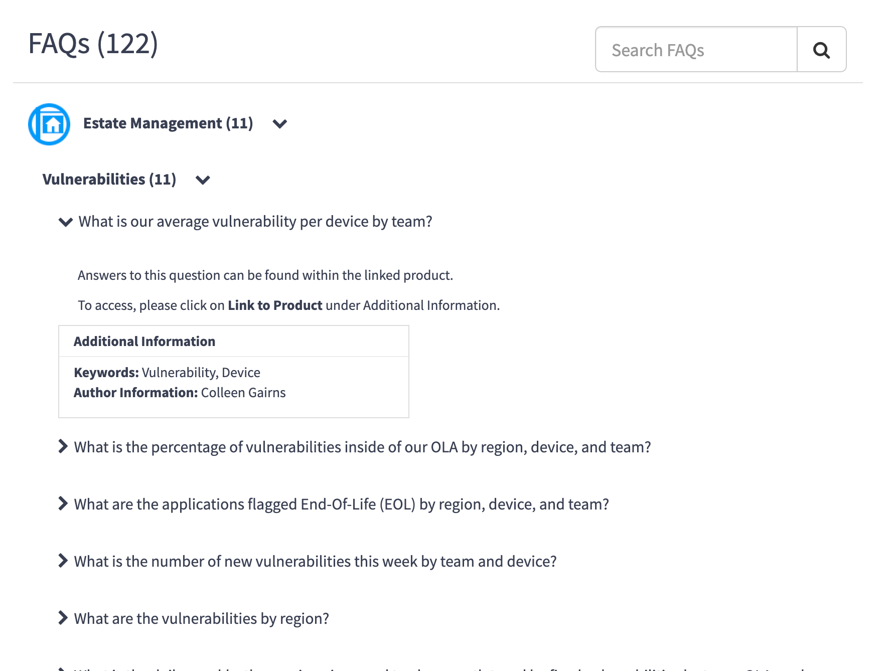

# Service Portal Snippets

## Contents
- [Services Examples](docs/examples/services.md)


### Setting Properties from Options
Server
```js
data.hide_additional_information = (options.hide_additional_information == 'true') ? true : false;
```

---


### Exploring Client/Server Relationship

###### Server Script
```js
(function() {
    // will run this every time client runs c.server.update()
    data.someVar;

    // will run this once per session
    if(!input) {

    } else if(input.action == 'someAction') {

    }

})();
```

----

### Calling Server From Client
There are a number of ways to call server-side code from the client in Service Portal

#### 1) `c.server.update()`


#### 2) `$http` Service

##### a) Processor
###### Service
```js
function RPService($http) {
    return {
        //...
        getResourceChartData: function(chartType, chartSubType, heatmapGroupType, timeScale, selectedPlans, reportingUnit) {
            return $http({
                url: '/resource_management_processor.do',
                method: 'get',
                params: {
                    sysparm_name: 'getChartData',
                    sysparm_processor: 'ResourcePortalService',
                    sysparm_chart_type: chartType,
                    sysparm_chart_sub_type: chartSubType,
                    sysparm_heat_map_group_type: heatmapGroupType,
                    sysparm_time_scale: timeScale,
					sysparm_reporting_unit: reportingUnit,
                    sysparm_include_plans: selectedPlans.join(',')
                }
            });
        },
```

###### Processor
*Path*: `resource_management_processor`

```js
var response = "";
var processorParm = g_request.getParameter('sysparm_processor');
if( processorParm == "ResourceWorkbenchService" ||
	processorParm == "ResourcePortalService" ||
	processorParm == "RMChartExportService" ||
    processorParm == "RMPPSWorkbenchService" ||
	processorParm == "ResourceReportService") {
		var processor=new this[g_request.getParameter('sysparm_processor')](g_request);
		response=processor[g_request.getParameter('sysparm_name')]();
}
else {
	response = {error: gs.getMessage('Access denied for this method')};
}

g_processor.writeOutput("application/json", response);
```

##### b) URL
Example 1:
```js
function($http) {
    // ...
    function runCounter(counter) {
        var url = "/api/now/stats/"+ c.options.table +"?sysparm_query="+ counter.filter +"&sysparm_count=true";
        $http.get(url).then(function(response) {
            // ...
        });
    }
}
```

Example 2:
```js
function NRRPService($http) {
    return {
        getPlans: function(encodedQuery, maxPlans) {
            if (!maxPlans)
                maxPlans = 50;
            var fields = 'sysparm_fields=number%2Csys_id%2Cgroup_resource%2Cresource_type%2Cuser_resource%2Cplan_type%2Coperational_work_type%2Ctask%2Cman_days%2Cfte%2Cplanned_hours%2Cstate%2Cshort_description%2Ctask.priority%2Ctask.short_description%2Ctask.sys_class_name';
            var url = '/api/now/table/resource_plan?' + fields + '&sysparm_limit=' + maxPlans + '&sysparm_display_value=all&sysparm_exclude_reference_link=true&sysparm_query=' + encodedQuery + '^ORDERBYtask.priority';
            return $http.get(url);
        },
    // ...
```


#### 3) UI Script & Scripted REST
###### Scripted REST Resource
*Type*: POST
```js
(function process(/*RESTAPIRequest*/ request, /*RESTAPIResponse*/ response) {
	var req = JSON.parse(request.body.dataString);
	var activity = req.tour;
	if(activity) {
		new x_nero_gamificatio.GamificationAPI().trackRecordActivity(gs.getUserID(), activity);
		return {
			tour: req.tour
		};
	} else {
		// ...
	}
})(request, response);
```

###### UI Script
```js
function testingSomething() {
	var data = {
		tour: 'ACT1008'
	};
	$.ajax({
		type: 'POST',
		url: '/api/x_nero_gamificatio/guided_tour_api',
		contentType: 'application/json',
		data: JSON.stringify(data)
	}).done(function(response) {
		// done
	})
	.fail(function() {
        // fail
	});
}
```

----------------------------------------------------------------------------------------------------------

### Embedding Widgets and Directives


----------------------------------------------------------------------------------------------------------


### Embedding Widgets

#### 1) Via HTML
```html
<widget id="widget-cool-clock"></widget>

<widget id="widget-cool-clock" options='{"zone": "America/Los_Angeles","title": "San Diego, CA"}'><widget>

<widget id=""></widget>
```

#### 2) Via Client Script


#### 3) Via Server Script
```html
<sp-widget widget="widget-id"></sp-widget>
```

```js
$sp.getWidget("widget-cool-clock", options[i])
```

----------------------------------------------------------------------------------------------------------

@todo
### Events
```js
$rootScope.$on('sp.form.record.updated', function() {
    $scope.data.userForm.data.f._ui_actions[1].is_button = true;
});

$rootScope.$on('data_table.click', function(event,obj) {
    var link = {};
    link.id = $scope.data.page;
    link.table = obj.table;
    link.sys_id = obj.sys_id;
    $location.search(link);
});

$scope.$on("field.change", function(evt, parms) { }
```

----------------------------------------------------------------------------------------------------------
@todo
### Implementing an Angular Template
###### Client Script
```js
function redirectUser(lastLoginDate){
  if(lastLoginDate == '' || lastLoginDate == null || lastLoginDate == 'undefined'){
    $scope.modalInstance = $uibModal.open({
      templateUrl: 'welcomeTemplate',
      windowClass: 'welcome-pref-modal',
      scope: $scope
    });
  }
}
```

-----

@todo
### Using `$location` to Redirect User
```js
$scope.closeAndEdit = function() {
  $scope.closeAndSave();
  $location.url('?id=user_profile');
};
```

----

@todo
### Form field change in Client Script
```js
$scope.$on('field.change', function(evt, parms) {
	//if (parms.field.name == c.data.user.name) {
	if (parms.oldValue == c.data.user.sys_id) {
		c.data.setLocation = parms.newValue;
	}
    c.data.currentUser = parms.newValue;
    c.server.update().then(function(response) {
        //spUtil.update($scope);
    });
});
```

----

@todo
### Capturing Data Table Click Event
```js
$rootScope.$on('data_table.click', function(a, b) {
    if(b.table === 'dmn_demand') {
        // go to
        window.location.href = '?id=psp_demand_record&sys_id=' + b.sys_id;
    }
});
```
> Use this snippet to capture the click event on a data table and redirect the user to a custom page


----

### Invoking REST Call from Server Script
```js
var r = new RESTMessage('Yahoo Finance', 'get');
r.setStringParameter('symbol', data.stock);
var response = r.execute();
data.price = response.getBody();
```

-----

### Using SWAL
###### Client Controller
```js
if(checkFields()) {
    swal({
        title: "Are you sure?",
        text: "This process will create translated text records for " + configString,
        icon: "warning",
        buttons: true,
        dangerMode: true
    })
    .then(function(willDelete) {
        if (willDelete) {
            c.toggleLoading(true);
            c.data.action = 'generateTranslations';
            c.server.update().then(function() {
                c.toggleLoading(false);
                c.generated = true;
                c.clearFields();
                swal("Translated text records have been created. View the log below.", {
                    icon: "success"
                });
            });
        } 
    });
} else {
    swal("Missing fields", "Please fill out the required fields.", "error");
}
```


----


## Misc

### Get a Widget from the **Portal** Record
```js
data.typeahead = $sp.getWidgetFromInstance('typeahead-search');
```

----

### Get Service Portal URL Suffix
```js
var url_suffix = $sp.getPortalRecord().getValue('url_suffix');
```

----

### Opening a Modal & Passing Scope to `$uibModal`
```js
$scope.openLogin = function () {
  $scope.modalInstance = $uibModal.open({
    templateUrl: 'modalLogin',
    scope: $scope
  });
};
```
Keywords: `modal`

----

### Different Angular Dependencies
```js
function ($rootScope, $scope, snRecordWatcher, spUtil, $location, $uibModal, cabrillo, $timeout, $window, $document) { /* code */ })
```

SN Specific:
- snRecordWatcher
- spUtil
- $uibModal
- cabrillo
- amb?

Angular:
- $location


---

### iFrames

Server
```js
data.iframeURL = 'http://www.google.com';
```

Client
```js
function ($sce) {
    $scope.iframeURL = $sce.trustAsResourceUrl(c.data.iframeURL);
}
```

HTML
```html
<iframe ng-src="{{iframeURL}}"></iframe>
```

----

### iFrames in Service Portal and CSS manipulation
```html
<div class="col-lg-12 col-md-12 page-section">
  <div class="section-head">
      UPDATE SECURITY QUESTIONS
    </div>
  <div class="frosted">
  	<iframe id="enrollChange" src="$pwd_enrollment_form_container.do" class="i-frame2" scrolling="no"></iframe>
  </div>
</div>
<script>
   $('#enrollChange').on('load', function() {
          $(this).contents().find('.navbar').css({
              'border': 'none',
              'background': 'transparent',
              'box-shadow': 'none',
              'margin-left': '20px',
              'margin-right': '20px'
          });
		
          $(this).contents().find('.navbar-btn').css({
              'display': 'none',
          });  
    		  $(this).contents().find('.nav-tabs > li.active').css({
              'border-top-color': 'rgb(86, 117, 141)',
          });         
    });   
</script>
```

----

### Displaying select boxes
```html
<div class="list-group">
      <label for="">${Select country}</label>
      <span class="list-group-item"
            ng-repeat="country in data.countries">
        <div class="input-group checkbox-container">
          <div class="checkbox-grp">
            <label class="font-light">
              <input class="m-r-sm"
                     type="checkbox"
                     value="{{::country.value}}"
                     ng-model="country.selected"
                     ng-change="c.countryChanged(country)" />
              {{::country.label}}
            </label>
          </div>          
        </div>
      </span>
    </div>
```

-----

### Iterating over objects while applying a filter
```html
<div class="col-md-4 clearfix item-container"
     ng-repeat="item in c.data.items | filter:c.data.term"
     ng-include="data.templateID">
```

-----

### Display Choice Label instead of Choice Value
```js
var ritm = new GlideRecord("sc_req_item");
ritm.query();
while(ritm.next()){
    ...
    reqItem.stage = $sp.getFieldsObject(ritm, 'stage').stage.display_value;
    ...
}
```

-----

### Using `$interval` Service
```js
function($interval) {
	var c = this;
	$interval(function () {
		c.server.refresh();
	}, 30000);  
}
```

----

### Force Reload
```js
c.server.update().then(function() {
    $window.location.reload();
});
```

----

### spNavStateManager

------

### Opening Data Table Records in New Tabs
One solution is as follows... Clone widget and change the following lines

```js
$scope.$emit(eventNames.click, parms);
```

to

```js
window.open( "/portal_id?id=page_id&table="+parms.table+"&sys_id="+ parms.sys_id,"_blank");
```

---

### Service Catalog - Manipulating Variables on Client Side
Grab values from service catalog form view

#### Client Script
```js
var syllabus = {
    instructorLastName: '',
    semesterTerm: '',
    courseDepartment: '',
    courseNumber: '',
    courseSection: ''
};

$rootScope.syllabusName = '';


// Instructor Last Name
$scope.$watch('c.widget.data.sc_cat_item._fields["IO:f39518cadbe9d344763e776baf961955"].displayValue', function(newValue, oldValue) {
    $scope.calculateName('instructorLastName', newValue);
});

// Semester Term
$scope.$watch('c.widget.data.sc_cat_item._fields["IO:d8e59c06dbe9d344763e776baf961981"].displayValue', function(newValue, oldValue) {
    $scope.calculateName('semesterTerm', newValue);
});

// Course Department
$scope.$watch('c.widget.data.sc_cat_item._fields["IO:e8d7dccedbe9d344763e776baf96193a"].displayValue', function(newValue, oldValue) {
    $scope.calculateName('courseDepartment', newValue);
});

// Course Number
$scope.$watch('c.widget.data.sc_cat_item._fields["IO:70ee5c06db6dd344763e776baf9619b1"].displayValue', function(newValue, oldValue) {
    $scope.calculateName('courseNumber', newValue);
});

// Course Section
$scope.$watch('c.widget.data.sc_cat_item._fields["IO:1d52644adb2dd344763e776baf961996"].displayValue', function(newValue, oldValue) {
    $scope.calculateName('courseSection', newValue);
});

$scope.calculateName = function(name, value) {
    syllabus[name] = value;
    $rootScope.syllabusName = syllabus.courseDepartment + syllabus.courseNumber + '-' + syllabus.courseSection + ' (' + syllabus.instructorLastName + ') ' + syllabus.semesterTerm;
}
```

---

### Accordion w/ UIB

HTML
```html
<div class="row spinner-content" ng-hide="data.spinner">
    <div class="col-sm-6 col-md-12 clearfix item-container"
         ng-repeat="category in c.data.collection | filter:c.data.term as filtered">
        <uib-accordion close-others="false">
			<uib-accordion-group class="accordion-container" is-open="category.open">
                <uib-accordion-heading>
                     
                    <b>{{category.name}} ({{category.totalItems}})</b>
                    <i class="fa m-l" ng-class="{'fa-chevron-down': category.open, 'fa-chevron-right': !category.open}"></i>
                </uib-accordion-heading>
                <div class="question-list" ng-if="subcat.items.length > 0" ng-repeat="subcat in category.subcategories | filter: c.data.term">
                    <uib-accordion close-others="false">
                        <uib-accordion-group is-open="subcat.open">
                            <uib-accordion-heading>
                                <b>{{subcat.name}} ({{subcat.items.length}})</b> 
                                <i class="fa m-l" ng-class="{'fa-chevron-down': subcat.open, 'fa-chevron-right': !subcat.open}"></i></uib-accordion-heading>
                                <div ng-if="subcat.items.length > 0" ng-repeat="item in subcat.items | filter: c.data.term">
                                    <uib-accordion close-others="false" >
                                        <uib-accordion-group is-open="item.open">
                                            <uib-accordion-heading>
                                                <i class="fa pull-left" ng-class="{'fa-chevron-down': item.open, 'fa-chevron-right': !item.open}"></i>
                                                <span ng-bind-html="c.bindHtml(item.question)"></span>
                                            </uib-accordion-heading>
                                            <div class="m-l-lg" ng-bind-html="c.bindHtml(item.answer)"></div>
                                                <div ng-if="item.answer_builder_result">
	                                                <p class="answer-builder-result m-l-lg" ng-bind-html="c.bindHtml(item.answer_builder_result)"></p>
                                                </div>
                                            </div>
                                        </div>
		                            </div>
                                </uib-accordion-group>
                            </uib-accordion>
                        </div>
                    </uib-accordion-group>
                </uib-accordion>
            </div>
        </uib-accordion-group>
    </uib-accordion>
</div>
```

Data structure
```js
[
  {
    "name": "Estate Management",
    "image": "28344ab01370634c4e61be622244b0d0.iix",
    "subcategories": [
      {
        "name": "Vulnerabilities",
        "items": [
          {
            "sysID": "0784c05b13aceb446d957e776144b087",
            "category": "Estate Management",
            "categoryImage": "28344ab01370634c4e61be622244b0d0.iix",
            "categorySysID": "5a6ee075132613402ae773076144b0e1",
            "subcategory": "Vulnerabilities",
            "question": "<div>\r\n<p>What is our average vulnerability per device by team?</p>\r\n</div>",
            "answer": "<p>Answers to this question can be found within the linked product.&nbsp;</p>\r\n<p>To access, please click on <strong>Link to Product</strong> under Additional Information.</p>",
            "link_to_product": "",
            "product_sys_id": null,
            "keywords": "Vulnerability, Device",
            "author": "Colleen Gairns",
            "sys_id": "0784c05b13aceb446d957e776144b087",
            "additional_insight": null,
            "image": "",
            "answer_builder_result": " ",
            "hide_answer_result": "0",
            "featured": "false",
            "$$hashKey": "object:1384",
            "open": true
          },
          {
            "sysID": "0855801313eceb446d957e776144b0d4",
            "category": "Estate Management",
            "categoryImage": "28344ab01370634c4e61be622244b0d0.iix",
            "categorySysID": "5a6ee075132613402ae773076144b0e1",
            "subcategory": "Vulnerabilities",
            "question": "<p>What is the percentage of vulnerabilities inside of our OLA by region, device, and team?</p>",
            "answer": "<p>Answers to this question can be found within the linked product.&nbsp;</p>\r\n<p>To access, please click on <strong>Link to Product</strong> under Additional Information.</p>",
            "link_to_product": "",
            "product_sys_id": null,
            "keywords": "Vulnerabilities, OLA",
            "author": "Colleen Gairns",
            "sys_id": "0855801313eceb446d957e776144b0d4",
            "additional_insight": null,
            "image": "",
            "answer_builder_result": " ",
            "hide_answer_result": "0",
            "featured": "false",
            "$$hashKey": "object:1385"
          },
          {
            "sysID": "11a7001713eceb446d957e776144b0e8",
            "category": "Estate Management",
            "categoryImage": "28344ab01370634c4e61be622244b0d0.iix",
            "categorySysID": "5a6ee075132613402ae773076144b0e1",
            "subcategory": "Vulnerabilities",
            "question": "<div>\r\n<p>What are the applications flagged End-Of-Life (EOL) by region, device, and team?</p>\r\n</div>",
            "answer": "<p>This is an answer.</p>",
            "link_to_product": "",
            "product_sys_id": null,
            "keywords": "Applications, End-of-Life, EOL",
            "author": "Colleen Gairns",
            "sys_id": "11a7001713eceb446d957e776144b0e8",
            "additional_insight": null,
            "image": "",
            "answer_builder_result": "<p>30</p> ",
            "hide_answer_result": "0",
            "featured": "false",
            "$$hashKey": "object:1386"
          },
          {
            "sysID": "1d93849713aceb446d957e776144b093",
            "category": "Estate Management",
            "categoryImage": "28344ab01370634c4e61be622244b0d0.iix",
            "categorySysID": "5a6ee075132613402ae773076144b0e1",
            "subcategory": "Vulnerabilities",
            "question": "<p>What is the number of new vulnerabilities this week by team and device?</p>",
            "answer": "<p>Answers to this question can be found within the linked product.&nbsp;</p>\r\n<p>To access, please click on <strong>Link to Product</strong> under Additional Information.</p>",
            "link_to_product": "",
            "product_sys_id": null,
            "keywords": "Vunlerabilities, Device",
            "author": "Colleen Gairns",
            "sys_id": "1d93849713aceb446d957e776144b093",
            "additional_insight": null,
            "image": "",
            "answer_builder_result": " ",
            "hide_answer_result": "0",
            "featured": "false",
            "$$hashKey": "object:1387"
          },
          {
            "sysID": "31c5481313eceb446d957e776144b0cd",
            "category": "Estate Management",
            "categoryImage": "28344ab01370634c4e61be622244b0d0.iix",
            "categorySysID": "5a6ee075132613402ae773076144b0e1",
            "subcategory": "Vulnerabilities",
            "question": "<div>\r\n<p>What are the vulnerabilities by region?</p>\r\n</div>",
            "answer": "<p>Answers to this question can be found within the linked product.&nbsp;</p>\r\n<p>To access, please click on <strong>Link to Product</strong> under Additional Information.</p>",
            "link_to_product": "",
            "product_sys_id": null,
            "keywords": "Vulnerabilities, Region",
            "author": "Colleen Gairns",
            "sys_id": "31c5481313eceb446d957e776144b0cd",
            "additional_insight": null,
            "image": "",
            "answer_builder_result": " ",
            "hide_answer_result": "0",
            "featured": "false",
            "$$hashKey": "object:1388"
          },
          {
            "sysID": "9c54441f13aceb446d957e776144b002",
            "category": "Estate Management",
            "categoryImage": "28344ab01370634c4e61be622244b0d0.iix",
            "categorySysID": "5a6ee075132613402ae773076144b0e1",
            "subcategory": "Vulnerabilities",
            "question": "<div>\r\n<p>What is the daily, weekly, three-, six-, nine-, and twelve-month trend by fixed vulnerabilities by team, OLA, and outside of OLA?</p>\r\n</div>",
            "answer": "<p>Answers to this question can be found within the linked product.&nbsp;</p>\r\n<p>To access, please click on <strong>Link to Product</strong> under Additional Information.</p>",
            "link_to_product": "",
            "product_sys_id": null,
            "keywords": "Vulnerabilities, OLA, Trend",
            "author": "Colleen Gairns",
            "sys_id": "9c54441f13aceb446d957e776144b002",
            "additional_insight": null,
            "image": "",
            "answer_builder_result": " ",
            "hide_answer_result": "0",
            "featured": "false",
            "$$hashKey": "object:1389"
          },
          {
            "sysID": "9dd38c1b13aceb446d957e776144b0a2",
            "category": "Estate Management",
            "categoryImage": "28344ab01370634c4e61be622244b0d0.iix",
            "categorySysID": "5a6ee075132613402ae773076144b0e1",
            "subcategory": "Vulnerabilities",
            "question": "<div>\r\n<p>What is the number of new vulnerabilities this week that are assigned?</p>\r\n</div>",
            "answer": "<p>Answers to this question can be found within the linked product.&nbsp;</p>\r\n<p>To access, please click on <strong>Link to Product</strong> under Additional Information.</p>",
            "link_to_product": "",
            "product_sys_id": null,
            "keywords": "Vulnerabilities, Assigned",
            "author": "Colleen Gairns",
            "sys_id": "9dd38c1b13aceb446d957e776144b0a2",
            "additional_insight": null,
            "image": "",
            "answer_builder_result": " ",
            "hide_answer_result": "0",
            "featured": "false",
            "$$hashKey": "object:1390"
          },
          {
            "sysID": "a9c4481313eceb446d957e776144b0c8",
            "category": "Estate Management",
            "categoryImage": "28344ab01370634c4e61be622244b0d0.iix",
            "categorySysID": "5a6ee075132613402ae773076144b0e1",
            "subcategory": "Vulnerabilities",
            "question": "<div>\r\n<p>What are the vulnerabilities with an End-Of-Life (EOL) operating system by region, device, and team?</p>\r\n</div>",
            "answer": "<p>Answers to this question can be found within the linked product.&nbsp;</p>\r\n<p>To access, please click on <strong>Link to Product</strong> under Additional Information.</p>",
            "link_to_product": "",
            "product_sys_id": null,
            "keywords": "Vulnerabilities, End-of-Life, EOL, Operating System, Device",
            "author": "Colleen Gairns",
            "sys_id": "a9c4481313eceb446d957e776144b0c8",
            "additional_insight": null,
            "image": "",
            "answer_builder_result": " ",
            "hide_answer_result": "0",
            "featured": "false",
            "$$hashKey": "object:1391"
          },
          {
            "sysID": "cd13c4db13aceb446d957e776144b04a",
            "category": "Estate Management",
            "categoryImage": "28344ab01370634c4e61be622244b0d0.iix",
            "categorySysID": "5a6ee075132613402ae773076144b0e1",
            "subcategory": "Vulnerabilities",
            "question": "<p>What is the daily trend of vulnerabilities?</p>",
            "answer": "<p>Answers to this question can be found within the linked product.&nbsp;</p>\r\n<p>To access, please click on <strong>Link to Product</strong> under Additional Information.</p>",
            "link_to_product": "",
            "product_sys_id": null,
            "keywords": "Trend, Vulnerabilities",
            "author": "Colleen Gairns",
            "sys_id": "cd13c4db13aceb446d957e776144b04a",
            "additional_insight": null,
            "image": "",
            "answer_builder_result": " ",
            "hide_answer_result": "0",
            "featured": "false",
            "$$hashKey": "object:1392"
          },
          {
            "sysID": "ed14041f13aceb446d957e776144b0f1",
            "category": "Estate Management",
            "categoryImage": "28344ab01370634c4e61be622244b0d0.iix",
            "categorySysID": "5a6ee075132613402ae773076144b0e1",
            "subcategory": "Vulnerabilities",
            "question": "<p>What is the daily, weekly, three-, six-, nine-, and twelve-month trend by severity, team, vulnerabilities in OLA, vulnerabilities outside of OLA, and vulnerability count?</p>",
            "answer": "<p>Answers to this question can be found within the linked product.&nbsp;</p>\r\n<p>To access, please click on <strong>Link to Product</strong> under Additional Information.</p>",
            "link_to_product": "",
            "product_sys_id": null,
            "keywords": "Vulnerabilities, OLA, Trend",
            "author": "Colleen Gairns",
            "sys_id": "ed14041f13aceb446d957e776144b0f1",
            "additional_insight": null,
            "image": "",
            "answer_builder_result": " ",
            "hide_answer_result": "0",
            "featured": "false",
            "$$hashKey": "object:1393"
          },
          {
            "sysID": "f3854cdb13aceb446d957e776144b04a",
            "category": "Estate Management",
            "categoryImage": "28344ab01370634c4e61be622244b0d0.iix",
            "categorySysID": "5a6ee075132613402ae773076144b0e1",
            "subcategory": "Vulnerabilities",
            "question": "<div>\r\n<p>What is the percentage of vulnerabilities outside of our OLA by region, device, and team?&nbsp;&nbsp;&nbsp;&nbsp;&nbsp;&nbsp;&nbsp;&nbsp;&nbsp;</p>\r\n</div>",
            "answer": "<p>Answers to this question can be found within the linked product.&nbsp;</p>\r\n<p>To access, please click on <strong>Link to Product</strong> under Additional Information.</p>",
            "link_to_product": "",
            "product_sys_id": null,
            "keywords": "Vulnerabilities, OLA",
            "author": "Colleen Gairns",
            "sys_id": "f3854cdb13aceb446d957e776144b04a",
            "additional_insight": null,
            "image": "",
            "answer_builder_result": " ",
            "hide_answer_result": "0",
            "featured": "false",
            "$$hashKey": "object:1394"
          }
        ],
        "open": true,
        "$$hashKey": "object:1378"
      }
    ],
    "open": true,
    "totalItems": 11,
    "$$hashKey": "object:1358"
  },
  {
    "name": "People",
    "image": "cd70a5381374eb0062dc59812244b0b9.iix",
    "subcategories": [
      {
        "name": "Time Card",
        "items": [
          {
            "sysID": "013042ae13a8a7c02ae773076144b00e",
            "category": "People",
            "categoryImage": "cd70a5381374eb0062dc59812244b0b9.iix",
            "categorySysID": "266695b013ee9b006d957e776144b0b0",
            "subcategory": "Time Card",
            "question": "<p>How many weekly hours are logged by employee, time, manager, status, and category?</p>",
            "answer": "<p>Answers to this question can be found within the linked product.&nbsp;</p>\r\n<p>To access, please click on <strong>Link to Product</strong> under Additional Information.</p>",
            "link_to_product": "Application Health Scorecard",
            "product_sys_id": "505a09fddb822bccd5afa9a5ca961943",
            "keywords": "Logged Hours",
            "author": "Colleen Gairns",
            "sys_id": "013042ae13a8a7c02ae773076144b00e",
            "additional_insight": null,
            "image": "9335f5f9dbca2bccd5afa9a5ca9619cb.iix",
            "answer_builder_result": "null ",
            "hide_answer_result": "0",
            "featured": "false",
            "$$hashKey": "object:1504"
          },
          {
            "sysID": "0d8f31ae13a8a7c02ae773076144b0fc",
            "category": "People",
            "categoryImage": "cd70a5381374eb0062dc59812244b0b9.iix",
            "categorySysID": "266695b013ee9b006d957e776144b0b0",
            "subcategory": "Time Card",
            "question": "<p>How many Missed/Unapproved Time Cards are there by employee, manger, and Month?</p>",
            "answer": "<p>Answers to this question can be found within the linked product.&nbsp;</p>\r\n<p>To access, please click on <strong>Link to Product</strong> under Additional Information.</p>",
            "link_to_product": "",
            "product_sys_id": null,
            "keywords": "Missed Time Card, Unapproved Time Card",
            "author": "Colleen Gairns",
            "sys_id": "0d8f31ae13a8a7c02ae773076144b0fc",
            "additional_insight": null,
            "image": "",
            "answer_builder_result": " ",
            "hide_answer_result": "0",
            "featured": "false",
            "$$hashKey": "object:1505"
          },
          {
            "sysID": "174f396e13a8a7c02ae773076144b030",
            "category": "People",
            "categoryImage": "cd70a5381374eb0062dc59812244b0b9.iix",
            "categorySysID": "266695b013ee9b006d957e776144b0b0",
            "subcategory": "Time Card",
            "question": "<p>How many Missed/Unapproved Hours are there by employee, manger, and Month?</p>",
            "answer": "<p>Answers to this question can be found within the linked product.&nbsp;</p>\r\n<p>To access, please click on <strong>Link to Product</strong> under Additional Information.</p>",
            "link_to_product": "",
            "product_sys_id": null,
            "keywords": "Missed Hours, Unapproved Hours",
            "author": "Colleen Gairns",
            "sys_id": "174f396e13a8a7c02ae773076144b030",
            "additional_insight": null,
            "image": "",
            "answer_builder_result": "null ",
            "hide_answer_result": "0",
            "featured": "false",
            "$$hashKey": "object:1506"
          },
          {
            "sysID": "52bf31ae13a8a7c02ae773076144b0ff",
            "category": "People",
            "categoryImage": "cd70a5381374eb0062dc59812244b0b9.iix",
            "categorySysID": "266695b013ee9b006d957e776144b0b0",
            "subcategory": "Time Card",
            "question": "<p>How many hours were submitted by sponsoring functional area?</p>",
            "answer": "<p>Answers to this question can be found within the linked product.&nbsp;</p>\r\n<p>To access, please click on <strong>Link to Product</strong> under Additional Information.</p>",
            "link_to_product": "",
            "product_sys_id": null,
            "keywords": "Hours",
            "author": "Colleen Gairns",
            "sys_id": "52bf31ae13a8a7c02ae773076144b0ff",
            "additional_insight": null,
            "image": "",
            "answer_builder_result": " ",
            "hide_answer_result": "0",
            "featured": "false",
            "$$hashKey": "object:1507"
          },
          {
            "sysID": "623eb92e13a8a7c02ae773076144b03a",
            "category": "People",
            "categoryImage": "cd70a5381374eb0062dc59812244b0b9.iix",
            "categorySysID": "266695b013ee9b006d957e776144b0b0",
            "subcategory": "Time Card",
            "question": "<p>What are the Admin, Build, Leadership, and Run Hours broken down by Manager?</p>",
            "answer": "<p>Answers to this question can be found within the linked product. &nbsp;<br /><br />To access, please click on <strong>Link to Product</strong> under Additional Information.</p>",
            "link_to_product": "",
            "product_sys_id": null,
            "keywords": "Admin, Build, Leadership, Run, Hours ",
            "author": "Colleen Gairns",
            "sys_id": "623eb92e13a8a7c02ae773076144b03a",
            "additional_insight": null,
            "image": "",
            "answer_builder_result": " ",
            "hide_answer_result": "0",
            "featured": "false",
            "$$hashKey": "object:1508"
          },
          {
            "sysID": "e80fb96e13a8a7c02ae773076144b041",
            "category": "People",
            "categoryImage": "cd70a5381374eb0062dc59812244b0b9.iix",
            "categorySysID": "266695b013ee9b006d957e776144b0b0",
            "subcategory": "Time Card",
            "question": "<p>What is the percentage of Category Hours (Admin, Run, Build, Leadership) submitted to Total Hours each week?</p>",
            "answer": "<p>Answers to this question can be found within the linked product.&nbsp;</p>\r\n<p>To access, please click on <strong>Link to Product</strong> under Additional Information.</p>",
            "link_to_product": "",
            "product_sys_id": null,
            "keywords": "Category Hours, Admin, Run, Build, Leadership",
            "author": "Colleen Gairns",
            "sys_id": "e80fb96e13a8a7c02ae773076144b041",
            "additional_insight": null,
            "image": "",
            "answer_builder_result": " ",
            "hide_answer_result": "0",
            "featured": "false",
            "$$hashKey": "object:1509"
          }
        ],
        "open": false,
        "$$hashKey": "object:1494"
      },
      {
        "name": "Travel",
        "items": [
          {
            "sysID": "01924fcf13a4eb446d957e776144b0b2",
            "category": "People",
            "categoryImage": "cd70a5381374eb0062dc59812244b0b9.iix",
            "categorySysID": "266695b013ee9b006d957e776144b0b0",
            "subcategory": "Travel",
            "question": "<div>\r\n<p>How many total trips have occurred for a specific destination location?</p>\r\n</div>",
            "answer": "",
            "link_to_product": "Application Health Scorecard",
            "product_sys_id": "505a09fddb822bccd5afa9a5ca961943",
            "keywords": "Trips, Travel, Destination, Location",
            "author": "Colleen Gairns",
            "sys_id": "01924fcf13a4eb446d957e776144b0b2",
            "additional_insight": null,
            "image": "9335f5f9dbca2bccd5afa9a5ca9619cb.iix",
            "answer_builder_result": "<p>55 Total Trips have occurred.</p> ",
            "hide_answer_result": "0",
            "featured": "false",
            "$$hashKey": "object:1569"
          },
          {
            "sysID": "0acd4f471368eb446d957e776144b09d",
            "category": "People",
            "categoryImage": "cd70a5381374eb0062dc59812244b0b9.iix",
            "categorySysID": "266695b013ee9b006d957e776144b0b0",
            "subcategory": "Travel",
            "question": "<p>How many unique trips have occurred, filtered by leader and their status?</p>",
            "answer": "<p>Answers to this question can be found within the linked product.&nbsp;</p>\r\n<p>To access, please click on <strong>Link to Product</strong> under Additional Information.</p>",
            "link_to_product": "",
            "product_sys_id": null,
            "keywords": "Trips, Travel, Leader, Status",
            "author": "Colleen Gairns",
            "sys_id": "0acd4f471368eb446d957e776144b09d",
            "additional_insight": null,
            "image": "",
            "answer_builder_result": " ",
            "hide_answer_result": "0",
            "featured": "false",
            "$$hashKey": "object:1570"
          },
          {
            "sysID": "2f99cf4b1328eb446d957e776144b0ff",
            "category": "People",
            "categoryImage": "cd70a5381374eb0062dc59812244b0b9.iix",
            "categorySysID": "266695b013ee9b006d957e776144b0b0",
            "subcategory": "Travel",
            "question": "<div>\r\n<p>What are top 10 air carriers?</p>\r\n</div>",
            "answer": "<p>Answers to this question can be found within the linked product.&nbsp;</p>\r\n<p>To access, please click on <strong>Link to Product</strong> under Additional Information.</p>",
            "link_to_product": "",
            "product_sys_id": null,
            "keywords": "Top 10, Air Carriers, Travel",
            "author": "Colleen Gairns",
            "sys_id": "2f99cf4b1328eb446d957e776144b0ff",
            "additional_insight": null,
            "image": "",
            "answer_builder_result": " ",
            "hide_answer_result": "0",
            "featured": "false",
            "$$hashKey": "object:1571"
          },
          {
            "sysID": "2fe7078f13e4eb446d957e776144b09f",
            "category": "People",
            "categoryImage": "cd70a5381374eb0062dc59812244b0b9.iix",
            "categorySysID": "266695b013ee9b006d957e776144b0b0",
            "subcategory": "Travel",
            "question": "<div>\r\n<p>Who are top 10 travelers calculated by spend and trip count?</p>\r\n</div>",
            "answer": "<p>Answers to this question can be found within the linked product.&nbsp;</p>\r\n<p>To access, please click on <strong>Link to Product</strong> under Additional Information.</p>",
            "link_to_product": "",
            "product_sys_id": null,
            "keywords": "Top 10, Travelers, Travel, Spend, Trip",
            "author": "Colleen Gairns",
            "sys_id": "2fe7078f13e4eb446d957e776144b09f",
            "additional_insight": null,
            "image": "",
            "answer_builder_result": " ",
            "hide_answer_result": "0",
            "featured": "false",
            "$$hashKey": "object:1572"
          },
          {
            "sysID": "3a59c74f1328eb446d957e776144b092",
            "category": "People",
            "categoryImage": "cd70a5381374eb0062dc59812244b0b9.iix",
            "categorySysID": "266695b013ee9b006d957e776144b0b0",
            "subcategory": "Travel",
            "question": "<div>\r\n<p>What are the top 10 travel destinations and routes?</p>\r\n</div>",
            "answer": "<p>Answers to this question can be found within the linked product.&nbsp;</p>\r\n<p>To access, please click on <strong>Link to Product</strong> under Additional Information.</p>",
            "link_to_product": "",
            "product_sys_id": null,
            "keywords": "Top 10, Destinations, Routes, Travel",
            "author": "Colleen Gairns",
            "sys_id": "3a59c74f1328eb446d957e776144b092",
            "additional_insight": null,
            "image": "",
            "answer_builder_result": " ",
            "hide_answer_result": "0",
            "featured": "false",
            "$$hashKey": "object:1573"
          },
          {
            "sysID": "6a90da50138c2f402ae773076144b0f8",
            "category": "People",
            "categoryImage": "cd70a5381374eb0062dc59812244b0b9.iix",
            "categorySysID": "266695b013ee9b006d957e776144b0b0",
            "subcategory": "Travel",
            "question": "<p>How does this product work?</p>",
            "answer": "<p>Test - Read the instructions</p>",
            "link_to_product": "",
            "product_sys_id": null,
            "keywords": "essential, important",
            "author": null,
            "sys_id": "6a90da50138c2f402ae773076144b0f8",
            "additional_insight": null,
            "image": "",
            "answer_builder_result": "",
            "hide_answer_result": "0",
            "featured": "false",
            "$$hashKey": "object:1574"
          },
          {
            "sysID": "9b240f0f13a4eb446d957e776144b0f1",
            "category": "People",
            "categoryImage": "cd70a5381374eb0062dc59812244b0b9.iix",
            "categorySysID": "266695b013ee9b006d957e776144b0b0",
            "subcategory": "Travel",
            "question": "<div>\r\n<p>What is the invoice amount recorded for a specific leader?</p>\r\n</div>",
            "answer": "<p>Answers to this question can be found within the linked product.&nbsp;</p>\r\n<p>To access, please click on <strong>Link to Product</strong> under Additional Information.</p>",
            "link_to_product": "",
            "product_sys_id": null,
            "keywords": "Invoice, Amount, Travel",
            "author": "Colleen Gairns",
            "sys_id": "9b240f0f13a4eb446d957e776144b0f1",
            "additional_insight": null,
            "image": "",
            "answer_builder_result": " ",
            "hide_answer_result": "0",
            "featured": "false",
            "$$hashKey": "object:1575"
          }
        ],
        "open": false,
        "$$hashKey": "object:1495"
      },
      {
        "name": "Headcount",
        "items": [
          {
            "sysID": "170ec16a13a4a7c02ae773076144b0fd",
            "category": "People",
            "categoryImage": "cd70a5381374eb0062dc59812244b0b9.iix",
            "categorySysID": "266695b013ee9b006d957e776144b0b0",
            "subcategory": "Headcount",
            "question": "<p>What is the average tenure and how does that compare across locations and role types?</p>",
            "answer": "<p>Answers to this question can be found within the linked product.&nbsp;</p>\r\n<p>To access, please click on <strong>Link to Product</strong> under Additional Information.</p>",
            "link_to_product": "",
            "product_sys_id": null,
            "keywords": "Tenure",
            "author": "Colleen Gairns",
            "sys_id": "170ec16a13a4a7c02ae773076144b0fd",
            "additional_insight": null,
            "image": "",
            "answer_builder_result": " ",
            "hide_answer_result": "0",
            "featured": "false",
            "$$hashKey": "object:1642"
          },
          {
            "sysID": "179ffda91324a3446d957e776144b086",
            "category": "People",
            "categoryImage": "cd70a5381374eb0062dc59812244b0b9.iix",
            "categorySysID": "266695b013ee9b006d957e776144b0b0",
            "subcategory": "Headcount",
            "question": "<p>Have hiring manager updates been provided for Open Positions?</p>",
            "answer": "<p>Answers to this question can be found within the linked product.&nbsp;</p>\r\n<p>To access, please click on <strong>Link to Product</strong> under Additional Information.</p>",
            "link_to_product": "",
            "product_sys_id": null,
            "keywords": "Hiring Manager, Updates, Open Positions",
            "author": "Colleen Gairns",
            "sys_id": "179ffda91324a3446d957e776144b086",
            "additional_insight": null,
            "image": "",
            "answer_builder_result": " ",
            "hide_answer_result": "0",
            "featured": "false",
            "$$hashKey": "object:1643"
          },
          {
            "sysID": "20ed452a13a4a7c02ae773076144b037",
            "category": "People",
            "categoryImage": "cd70a5381374eb0062dc59812244b0b9.iix",
            "categorySysID": "266695b013ee9b006d957e776144b0b0",
            "subcategory": "Headcount",
            "question": "<p>Where are Technology employees based?</p>",
            "answer": "<p>Answers to this question can be found within the linked product.&nbsp;</p>\r\n<p>To access, please click on <strong>Link to Product</strong> under Additional Information.</p>",
            "link_to_product": "",
            "product_sys_id": null,
            "keywords": "Employees, Based",
            "author": "Colleen Gairns",
            "sys_id": "20ed452a13a4a7c02ae773076144b037",
            "additional_insight": null,
            "image": "",
            "answer_builder_result": " ",
            "hide_answer_result": "0",
            "featured": "false",
            "$$hashKey": "object:1644"
          },
          {
            "sysID": "379d452a13a4a7c02ae773076144b032",
            "category": "People",
            "categoryImage": "cd70a5381374eb0062dc59812244b0b9.iix",
            "categorySysID": "266695b013ee9b006d957e776144b0b0",
            "subcategory": "Headcount",
            "question": "<p>How many operating layers exist and how does that compare across various leadership groups?</p>",
            "answer": "<p>Answers to this question can be found within the linked product.&nbsp;</p>\r\n<p>To access, please click on <strong>Link to Product</strong> under Additional Information.</p>",
            "link_to_product": "",
            "product_sys_id": null,
            "keywords": "Operating Layers",
            "author": "Colleen Gairns",
            "sys_id": "379d452a13a4a7c02ae773076144b032",
            "additional_insight": null,
            "image": "",
            "answer_builder_result": " ",
            "hide_answer_result": "0",
            "featured": "false",
            "$$hashKey": "object:1645"
          },
          {
            "sysID": "623e09aa13a4a7c02ae773076144b0f9",
            "category": "People",
            "categoryImage": "cd70a5381374eb0062dc59812244b0b9.iix",
            "categorySysID": "266695b013ee9b006d957e776144b0b0",
            "subcategory": "Headcount",
            "question": "<p>How does gender diversity compare across groups and/or locations?</p>",
            "answer": "<p>Answers to this question can be found within the linked product.&nbsp;</p>\r\n<p>To access, please click on <strong>Link to Product</strong> under Additional Information.</p>",
            "link_to_product": "",
            "product_sys_id": null,
            "keywords": "Gender Diversity",
            "author": "Colleen Gairns",
            "sys_id": "623e09aa13a4a7c02ae773076144b0f9",
            "additional_insight": null,
            "image": "",
            "answer_builder_result": " ",
            "hide_answer_result": "0",
            "featured": "false",
            "$$hashKey": "object:1646"
          },
          {
            "sysID": "6c6e41aa13a4a7c02ae773076144b036",
            "category": "People",
            "categoryImage": "cd70a5381374eb0062dc59812244b0b9.iix",
            "categorySysID": "266695b013ee9b006d957e776144b0b0",
            "subcategory": "Headcount",
            "question": "<p>How has Technology headcount trended over an extended period?</p>",
            "answer": "<p>Answers to this question can be found within the linked product.&nbsp;</p>\r\n<p>To access, please click on <strong>Link to Product</strong> under Additional Information.</p>",
            "link_to_product": "",
            "product_sys_id": null,
            "keywords": "Headcount, Trend",
            "author": "Colleen Gairns",
            "sys_id": "6c6e41aa13a4a7c02ae773076144b036",
            "additional_insight": null,
            "image": "",
            "answer_builder_result": " ",
            "hide_answer_result": "0",
            "featured": "false",
            "$$hashKey": "object:1647"
          },
          {
            "sysID": "9d7d3d291324a3446d957e776144b00a",
            "category": "People",
            "categoryImage": "cd70a5381374eb0062dc59812244b0b9.iix",
            "categorySysID": "266695b013ee9b006d957e776144b0b0",
            "subcategory": "Headcount",
            "question": "<p>What are the status and details for Open Positions?</p>",
            "answer": "<p>Answers to this question can be found within the linked product.&nbsp;</p>\r\n<p>To access, please click on <strong>Link to Product</strong> under Additional Information.</p>",
            "link_to_product": "",
            "product_sys_id": null,
            "keywords": "Open Positions",
            "author": "Colleen Gairns",
            "sys_id": "9d7d3d291324a3446d957e776144b00a",
            "additional_insight": null,
            "image": "",
            "answer_builder_result": " ",
            "hide_answer_result": "0",
            "featured": "false",
            "$$hashKey": "object:1648"
          },
          {
            "sysID": "a14d892a13a4a7c02ae773076144b091",
            "category": "People",
            "categoryImage": "cd70a5381374eb0062dc59812244b0b9.iix",
            "categorySysID": "266695b013ee9b006d957e776144b0b0",
            "subcategory": "Headcount",
            "question": "<p>How many employees work in Technology?</p>",
            "answer": "<p>Answers to this question can be found within the linked product.&nbsp;</p>\r\n<p>To access, please click on <strong>Link to Product</strong> under Additional Information.</p>",
            "link_to_product": "",
            "product_sys_id": null,
            "keywords": "Employees",
            "author": "Colleen Gairns",
            "sys_id": "a14d892a13a4a7c02ae773076144b091",
            "additional_insight": null,
            "image": "",
            "answer_builder_result": " ",
            "hide_answer_result": "0",
            "featured": "false",
            "$$hashKey": "object:1649"
          },
          {
            "sysID": "b8edb5691324a3446d957e776144b066",
            "category": "People",
            "categoryImage": "cd70a5381374eb0062dc59812244b0b9.iix",
            "categorySysID": "266695b013ee9b006d957e776144b0b0",
            "subcategory": "Headcount",
            "question": "<p>Are there health issues related to each of my Open Positions such as a position being listed in the tracker but not in Taleo?</p>",
            "answer": "<p>Answers to this question can be found within the linked product.&nbsp;</p>\r\n<p>To access, please click on <strong>Link to Product</strong> under Additional Information.</p>",
            "link_to_product": "",
            "product_sys_id": null,
            "keywords": "Health Issues, Open Positions",
            "author": "Colleen Gairns",
            "sys_id": "b8edb5691324a3446d957e776144b066",
            "additional_insight": null,
            "image": "",
            "answer_builder_result": " ",
            "hide_answer_result": "0",
            "featured": "false",
            "$$hashKey": "object:1650"
          },
          {
            "sysID": "cbebb5e51324a3446d957e776144b031",
            "category": "People",
            "categoryImage": "cd70a5381374eb0062dc59812244b0b9.iix",
            "categorySysID": "266695b013ee9b006d957e776144b0b0",
            "subcategory": "Headcount",
            "question": "<p>How many Open Positions do I have as a hiring manager or as the manager of&nbsp;hiring managers?</p>",
            "answer": "<p>&nbsp;</p>\r\n<p>Answers to this question can be found within the linked product.&nbsp;</p>\r\n<p>To access, please click on <strong>Link to Product</strong> under Additional Information.</p>",
            "link_to_product": "",
            "product_sys_id": null,
            "keywords": "Open Positions",
            "author": "Colleen Gairns",
            "sys_id": "cbebb5e51324a3446d957e776144b031",
            "additional_insight": null,
            "image": "",
            "answer_builder_result": " ",
            "hide_answer_result": "0",
            "featured": "false",
            "$$hashKey": "object:1651"
          }
        ],
        "open": false,
        "$$hashKey": "object:1496"
      }
    ],
    "open": false,
    "totalItems": 23,
    "$$hashKey": "object:1359"
  },
  {
    "name": "Projects and Demand",
    "image": "c63085061b28b3c09d6f7510cd4bcb15.iix",
    "subcategories": [
      {
        "name": "Vendor Management",
        "items": [
          {
            "sysID": "18da3747136ceb446d957e776144b0a6",
            "category": "Projects and Demand",
            "categoryImage": "c63085061b28b3c09d6f7510cd4bcb15.iix",
            "categorySysID": "2ff1886ddb675304e59a01a3ca961990",
            "subcategory": "Vendor Management",
            "question": "<p>Which vendors belong to&nbsp;a particular domain bucket?</p>",
            "answer": "<p>Answers to this question can be found within the linked product.&nbsp;</p>\r\n<p>To access, please click on <strong>Link to Product</strong> under Additional Information.</p>",
            "link_to_product": "",
            "product_sys_id": null,
            "keywords": "Vendor, Domain Bucket",
            "author": "Colleen Gairns",
            "sys_id": "18da3747136ceb446d957e776144b0a6",
            "additional_insight": null,
            "image": "",
            "answer_builder_result": " ",
            "hide_answer_result": "0",
            "featured": "false",
            "$$hashKey": "object:1750"
          },
          {
            "sysID": "2108efc713e8eb446d957e776144b0e6",
            "category": "Projects and Demand",
            "categoryImage": "c63085061b28b3c09d6f7510cd4bcb15.iix",
            "categorySysID": "2ff1886ddb675304e59a01a3ca961990",
            "subcategory": "Vendor Management",
            "question": "<p>What are our top 5 vendors identified by vendor categories?</p>",
            "answer": "<p>Answers to this question can be found within the linked product.&nbsp;</p>\r\n<p>To access, please click on <strong>Link to Product</strong> under Additional Information.</p>",
            "link_to_product": "",
            "product_sys_id": null,
            "keywords": "Top 5, Vendor, Vendor Category",
            "author": "Colleen Gairns",
            "sys_id": "2108efc713e8eb446d957e776144b0e6",
            "additional_insight": null,
            "image": "",
            "answer_builder_result": " ",
            "hide_answer_result": "0",
            "featured": "false",
            "$$hashKey": "object:1751"
          },
          {
            "sysID": "455aa34b13e8eb446d957e776144b0af",
            "category": "Projects and Demand",
            "categoryImage": "c63085061b28b3c09d6f7510cd4bcb15.iix",
            "categorySysID": "2ff1886ddb675304e59a01a3ca961990",
            "subcategory": "Vendor Management",
            "question": "<p>Who are our active vendors&nbsp;identified by vendor type?</p>",
            "answer": "<p>Answers to this question can be found within the linked product.&nbsp;</p>\r\n<p>To access, please click on <strong>Link to Product</strong> under Additional Information.</p>",
            "link_to_product": "",
            "product_sys_id": null,
            "keywords": "Vendors, Vendor Type, Champ, Challenger, Niche, Contender",
            "author": "Colleen Gairns",
            "sys_id": "455aa34b13e8eb446d957e776144b0af",
            "additional_insight": null,
            "image": "",
            "answer_builder_result": " ",
            "hide_answer_result": "0",
            "featured": "false",
            "$$hashKey": "object:1752"
          },
          {
            "sysID": "50f8174313a8eb446d957e776144b06c",
            "category": "Projects and Demand",
            "categoryImage": "c63085061b28b3c09d6f7510cd4bcb15.iix",
            "categorySysID": "2ff1886ddb675304e59a01a3ca961990",
            "subcategory": "Vendor Management",
            "question": "<p>How much money have we saved via discounts, filtered&nbsp;by total, vendor, project, and vendor type?</p>",
            "answer": "<p>Answers to this question can be found within the linked product.&nbsp;</p>\r\n<p>To access, please click on <strong>Link to Product</strong> under Additional Information.</p>",
            "link_to_product": "",
            "product_sys_id": null,
            "keywords": "Discounts, Vendor, Project",
            "author": "Colleen Gairns",
            "sys_id": "50f8174313a8eb446d957e776144b06c",
            "additional_insight": null,
            "image": "",
            "answer_builder_result": " ",
            "hide_answer_result": "0",
            "featured": "false",
            "$$hashKey": "object:1753"
          },
          {
            "sysID": "535b67cb13e8eb446d957e776144b001",
            "category": "Projects and Demand",
            "categoryImage": "c63085061b28b3c09d6f7510cd4bcb15.iix",
            "categorySysID": "2ff1886ddb675304e59a01a3ca961990",
            "subcategory": "Vendor Management",
            "question": "<p>What is our current allocated spend compared to our actual spend and filtered by total, vendor, project, and vendor type?</p>",
            "answer": "<p>Answers to this question can be found within the linked product.&nbsp;</p>\r\n<p>To access, please click on <strong>Link to Product</strong> under Additional Information.</p>",
            "link_to_product": "",
            "product_sys_id": null,
            "keywords": "Spend, Allocated, Actual, Vendor, Project",
            "author": "Colleen Gairns",
            "sys_id": "535b67cb13e8eb446d957e776144b001",
            "additional_insight": null,
            "image": "",
            "answer_builder_result": " ",
            "hide_answer_result": "0",
            "featured": "false",
            "$$hashKey": "object:1754"
          },
          {
            "sysID": "60fb378b136ceb446d957e776144b0f3",
            "category": "Projects and Demand",
            "categoryImage": "c63085061b28b3c09d6f7510cd4bcb15.iix",
            "categorySysID": "2ff1886ddb675304e59a01a3ca961990",
            "subcategory": "Vendor Management",
            "question": "<p>What business areas do Technology vendor projects support?</p>",
            "answer": "<p>Answers to this question can be found within the linked product.&nbsp;</p>\r\n<p>To access, please click on <strong>Link to Product</strong> under Additional Information.</p>",
            "link_to_product": "",
            "product_sys_id": null,
            "keywords": "Business Area, Vendor, Project",
            "author": "Colleen Gairns",
            "sys_id": "60fb378b136ceb446d957e776144b0f3",
            "additional_insight": null,
            "image": "",
            "answer_builder_result": " ",
            "hide_answer_result": "0",
            "featured": "false",
            "$$hashKey": "object:1755"
          },
          {
            "sysID": "692cb383136ceb446d957e776144b02e",
            "category": "Projects and Demand",
            "categoryImage": "c63085061b28b3c09d6f7510cd4bcb15.iix",
            "categorySysID": "2ff1886ddb675304e59a01a3ca961990",
            "subcategory": "Vendor Management",
            "question": "<p>What percentage of NPS scores are Promotors, Detractors, or Passives?</p>",
            "answer": "<p>Answers to this question can be found within the linked product.&nbsp;</p>\r\n<p>To access, please click on <strong>Link to Product</strong> under Additional Information.</p>",
            "link_to_product": "",
            "product_sys_id": null,
            "keywords": "NPS, Score, Promotors, Detractors, Passives",
            "author": "Colleen Gairns",
            "sys_id": "692cb383136ceb446d957e776144b02e",
            "additional_insight": null,
            "image": "",
            "answer_builder_result": " ",
            "hide_answer_result": "0",
            "featured": "false",
            "$$hashKey": "object:1756"
          },
          {
            "sysID": "7568178313a8eb446d957e776144b04e",
            "category": "Projects and Demand",
            "categoryImage": "c63085061b28b3c09d6f7510cd4bcb15.iix",
            "categorySysID": "2ff1886ddb675304e59a01a3ca961990",
            "subcategory": "Vendor Management",
            "question": "<p>What is our projected spend by total, vendor, project, and vendor type?</p>",
            "answer": "<p>Answers to this question can be found within the linked product.&nbsp;</p>\r\n<p>To access, please click on <strong>Link to Product</strong> under Additional Information.</p>",
            "link_to_product": "",
            "product_sys_id": null,
            "keywords": "Spend, Vendor, Project",
            "author": "Colleen Gairns",
            "sys_id": "7568178313a8eb446d957e776144b04e",
            "additional_insight": null,
            "image": "",
            "answer_builder_result": " ",
            "hide_answer_result": "0",
            "featured": "false",
            "$$hashKey": "object:1757"
          },
          {
            "sysID": "7cb7efc713e8eb446d957e776144b0ef",
            "category": "Projects and Demand",
            "categoryImage": "c63085061b28b3c09d6f7510cd4bcb15.iix",
            "categorySysID": "2ff1886ddb675304e59a01a3ca961990",
            "subcategory": "Vendor Management",
            "question": "<p>What are the vendor NPS survey scores, filtered by total, vendor, project, and vendor type?</p>",
            "answer": "<p>Answers to this question can be found within the linked product.&nbsp;</p>\r\n<p>To access, please click on <strong>Link to Product</strong> under Additional Information.</p>",
            "link_to_product": "",
            "product_sys_id": null,
            "keywords": "NPS, Score, Vendor, Project",
            "author": "Colleen Gairns",
            "sys_id": "7cb7efc713e8eb446d957e776144b0ef",
            "additional_insight": null,
            "image": "",
            "answer_builder_result": " ",
            "hide_answer_result": "0",
            "featured": "false",
            "$$hashKey": "object:1758"
          },
          {
            "sysID": "a0bb3307136ceb446d957e776144b081",
            "category": "Projects and Demand",
            "categoryImage": "c63085061b28b3c09d6f7510cd4bcb15.iix",
            "categorySysID": "2ff1886ddb675304e59a01a3ca961990",
            "subcategory": "Vendor Management",
            "question": "<p>What domain bucket is used for a particular project?</p>",
            "answer": "<p>Answers to this question can be found within the linked product.&nbsp;</p>\r\n<p>To access, please click on <strong>Link to Product</strong> under Additional Information.</p>",
            "link_to_product": "",
            "product_sys_id": null,
            "keywords": "Domain Bucket, Project",
            "author": "Colleen Gairns",
            "sys_id": "a0bb3307136ceb446d957e776144b081",
            "additional_insight": null,
            "image": "",
            "answer_builder_result": " ",
            "hide_answer_result": "0",
            "featured": "false",
            "$$hashKey": "object:1759"
          },
          {
            "sysID": "a157ebc313e8eb446d957e776144b0c9",
            "category": "Projects and Demand",
            "categoryImage": "c63085061b28b3c09d6f7510cd4bcb15.iix",
            "categorySysID": "2ff1886ddb675304e59a01a3ca961990",
            "subcategory": "Vendor Management",
            "question": "<p>How much money have we saved via negotiations of work, filtered by total, vendor, project, and vendor type?</p>",
            "answer": "<p>Answers to this question can be found within the linked product.&nbsp;</p>\r\n<p>To access, please click on <strong>Link to Product</strong> under Additional Information.</p>",
            "link_to_product": "",
            "product_sys_id": null,
            "keywords": "Saved, Negotiations, Vendor, Project",
            "author": "Colleen Gairns",
            "sys_id": "a157ebc313e8eb446d957e776144b0c9",
            "additional_insight": null,
            "image": "",
            "answer_builder_result": " ",
            "hide_answer_result": "0",
            "featured": "false",
            "$$hashKey": "object:1760"
          },
          {
            "sysID": "aa089bc313a8eb446d957e776144b0da",
            "category": "Projects and Demand",
            "categoryImage": "c63085061b28b3c09d6f7510cd4bcb15.iix",
            "categorySysID": "2ff1886ddb675304e59a01a3ca961990",
            "subcategory": "Vendor Management",
            "question": "<p>Did we hit our SLAs on Consulting Projects?</p>",
            "answer": "<p>Answers to this question can be found within the linked product.&nbsp;</p>\r\n<p>To access, please click on Link to Product under Additional Information.</p>",
            "link_to_product": "",
            "product_sys_id": null,
            "keywords": "SLA, Consulting Projects",
            "author": "Colleen Gairns",
            "sys_id": "aa089bc313a8eb446d957e776144b0da",
            "additional_insight": null,
            "image": "",
            "answer_builder_result": " ",
            "hide_answer_result": "0",
            "featured": "false",
            "$$hashKey": "object:1761"
          },
          {
            "sysID": "b5f9f787136ceb446d957e776144b035",
            "category": "Projects and Demand",
            "categoryImage": "c63085061b28b3c09d6f7510cd4bcb15.iix",
            "categorySysID": "2ff1886ddb675304e59a01a3ca961990",
            "subcategory": "Vendor Management",
            "question": "<p>What is the status of our vendor projects?</p>",
            "answer": "<p>Answers to this question can be found within the linked product.&nbsp;</p>\r\n<p>To access, please click on <strong>Link to Product</strong> under Additional Information.</p>",
            "link_to_product": "",
            "product_sys_id": null,
            "keywords": "Status, Vendor, Projects",
            "author": "Colleen Gairns",
            "sys_id": "b5f9f787136ceb446d957e776144b035",
            "additional_insight": null,
            "image": "",
            "answer_builder_result": " ",
            "hide_answer_result": "0",
            "featured": "false",
            "$$hashKey": "object:1762"
          },
          {
            "sysID": "bea86b8713e8eb446d957e776144b02d",
            "category": "Projects and Demand",
            "categoryImage": "c63085061b28b3c09d6f7510cd4bcb15.iix",
            "categorySysID": "2ff1886ddb675304e59a01a3ca961990",
            "subcategory": "Vendor Management",
            "question": "<p>Which active vendors are currently engaged in technology consulting?</p>",
            "answer": "<p>Answers to this question can be found within the linked product.&nbsp;</p>\r\n<p>To access, please click on <strong>Link to Product</strong> under Additional Information.</p>",
            "link_to_product": "",
            "product_sys_id": null,
            "keywords": "Active Vendors, Technology Consulting",
            "author": "Colleen Gairns",
            "sys_id": "bea86b8713e8eb446d957e776144b02d",
            "additional_insight": null,
            "image": "",
            "answer_builder_result": " ",
            "hide_answer_result": "0",
            "featured": "false",
            "$$hashKey": "object:1763"
          },
          {
            "sysID": "c22d33c313aceb446d957e776144b0d0",
            "category": "Projects and Demand",
            "categoryImage": "c63085061b28b3c09d6f7510cd4bcb15.iix",
            "categorySysID": "2ff1886ddb675304e59a01a3ca961990",
            "subcategory": "Vendor Management",
            "question": "<p>What is the monthly trend of NPS scores filtered by total, vendor, project, and vendor type?</p>",
            "answer": "<p>Answers to this question can be found within the linked product.&nbsp;</p>\r\n<p>To access, please click on <strong>Link to Product</strong> under Additional Information.</p>",
            "link_to_product": "",
            "product_sys_id": null,
            "keywords": "Trend, NPS, Score, Vendor, Project",
            "author": "Colleen Gairns",
            "sys_id": "c22d33c313aceb446d957e776144b0d0",
            "additional_insight": null,
            "image": "",
            "answer_builder_result": " ",
            "hide_answer_result": "0",
            "featured": "false",
            "$$hashKey": "object:1764"
          },
          {
            "sysID": "d14a7f4b132ceb446d957e776144b01d",
            "category": "Projects and Demand",
            "categoryImage": "c63085061b28b3c09d6f7510cd4bcb15.iix",
            "categorySysID": "2ff1886ddb675304e59a01a3ca961990",
            "subcategory": "Vendor Management",
            "question": "<p>What is the status on each vendor in relation to the Champ/Challenger program?</p>",
            "answer": "<p>Answers to this question can be found within the linked product.&nbsp;</p>\r\n<p>To access, please click on <strong>Link to Product</strong> under Additional Information.</p>",
            "link_to_product": "",
            "product_sys_id": null,
            "keywords": "Status, Vendor, Champ/Challenger",
            "author": "Colleen Gairns",
            "sys_id": "d14a7f4b132ceb446d957e776144b01d",
            "additional_insight": null,
            "image": "",
            "answer_builder_result": " ",
            "hide_answer_result": "0",
            "featured": "false",
            "$$hashKey": "object:1765"
          },
          {
            "sysID": "d6b85b4313a8eb446d957e776144b0aa",
            "category": "Projects and Demand",
            "categoryImage": "c63085061b28b3c09d6f7510cd4bcb15.iix",
            "categorySysID": "2ff1886ddb675304e59a01a3ca961990",
            "subcategory": "Vendor Management",
            "question": "<p>What is our actual spend on vendors by total, vendor, project, and vendor type?</p>",
            "answer": "<p>Answers to this question can be found within the linked product.&nbsp;</p>\r\n<p>To access, please click on <strong>Link to Product</strong> under Additional Information.</p>",
            "link_to_product": "",
            "product_sys_id": null,
            "keywords": "Spend, Vendor, Project",
            "author": "Colleen Gairns",
            "sys_id": "d6b85b4313a8eb446d957e776144b0aa",
            "additional_insight": null,
            "image": "",
            "answer_builder_result": " ",
            "hide_answer_result": "0",
            "featured": "false",
            "$$hashKey": "object:1766"
          }
        ],
        "open": false,
        "$$hashKey": "object:1742"
      },
      {
        "name": "Project Management",
        "items": [
          {
            "sysID": "366f052e13a4a7c02ae773076144b0dc",
            "category": "Projects and Demand",
            "categoryImage": "c63085061b28b3c09d6f7510cd4bcb15.iix",
            "categorySysID": "2ff1886ddb675304e59a01a3ca961990",
            "subcategory": "Project Management",
            "question": "<p>How many active projects do I have?</p>",
            "answer": "<p>Answers to this question can be found within the linked product.&nbsp;</p>\r\n<p>To access, please click on <strong>Link to Product</strong> under Additional Information.</p>",
            "link_to_product": "",
            "product_sys_id": null,
            "keywords": "Active Projects",
            "author": "Colleen Gairns",
            "sys_id": "366f052e13a4a7c02ae773076144b0dc",
            "additional_insight": null,
            "image": "",
            "answer_builder_result": " ",
            "hide_answer_result": "0",
            "featured": "false",
            "$$hashKey": "object:1924"
          },
          {
            "sysID": "ccff052e13a4a7c02ae773076144b0f2",
            "category": "Projects and Demand",
            "categoryImage": "c63085061b28b3c09d6f7510cd4bcb15.iix",
            "categorySysID": "2ff1886ddb675304e59a01a3ca961990",
            "subcategory": "Project Management",
            "question": "<p>What is the breakdown by status of my active projects?</p>",
            "answer": "<p>Answers to this question can be found within the linked product.&nbsp;</p>\r\n<p>To access, please click on <strong>Link to Product</strong> under Additional Information.</p>",
            "link_to_product": "",
            "product_sys_id": null,
            "keywords": "Active Projects, Status",
            "author": "Colleen Gairns",
            "sys_id": "ccff052e13a4a7c02ae773076144b0f2",
            "additional_insight": null,
            "image": "",
            "answer_builder_result": " ",
            "hide_answer_result": "0",
            "featured": "false",
            "$$hashKey": "object:1925"
          },
          {
            "sysID": "cecf416e13a4a7c02ae773076144b07d",
            "category": "Projects and Demand",
            "categoryImage": "c63085061b28b3c09d6f7510cd4bcb15.iix",
            "categorySysID": "2ff1886ddb675304e59a01a3ca961990",
            "subcategory": "Project Management",
            "question": "<p>What is the health of my active projects?</p>",
            "answer": "<p>Answers to this question can be found within the linked product.&nbsp;</p>\r\n<p>To access, please click on <strong>Link to Product</strong> under Additional Information.</p>",
            "link_to_product": "",
            "product_sys_id": null,
            "keywords": "Active Projects, Health",
            "author": "Colleen Gairns",
            "sys_id": "cecf416e13a4a7c02ae773076144b07d",
            "additional_insight": null,
            "image": "",
            "answer_builder_result": " ",
            "hide_answer_result": "0",
            "featured": "false",
            "$$hashKey": "object:1926"
          },
          {
            "sysID": "d88095ae13a4a7c02ae773076144b0ca",
            "category": "Projects and Demand",
            "categoryImage": "c63085061b28b3c09d6f7510cd4bcb15.iix",
            "categorySysID": "2ff1886ddb675304e59a01a3ca961990",
            "subcategory": "Project Management",
            "question": "<p>How many projects related to me were closed last month and how many are scheduled to be closed this month?</p>",
            "answer": "<p>Answers to this question can be found within the linked product.&nbsp;</p>\r\n<p>To access, please click on<strong> Link to Product</strong> under Additional Information.</p>",
            "link_to_product": "",
            "product_sys_id": null,
            "keywords": "Projects, Closed",
            "author": "Colleen Gairns",
            "sys_id": "d88095ae13a4a7c02ae773076144b0ca",
            "additional_insight": null,
            "image": "",
            "answer_builder_result": " ",
            "hide_answer_result": "0",
            "featured": "false",
            "$$hashKey": "object:1927"
          },
          {
            "sysID": "daa0556e13a4a7c02ae773076144b06e",
            "category": "Projects and Demand",
            "categoryImage": "c63085061b28b3c09d6f7510cd4bcb15.iix",
            "categorySysID": "2ff1886ddb675304e59a01a3ca961990",
            "subcategory": "Project Management",
            "question": "<p>Are there any Change Controls related to my active projects?</p>",
            "answer": "<p>Answers to this question can be found within the linked product.&nbsp;</p>\r\n<p>To access, please click on <strong>Link to Product</strong> under Additional Information.</p>",
            "link_to_product": "",
            "product_sys_id": null,
            "keywords": "Change Controls, Active Projects",
            "author": "Colleen Gairns",
            "sys_id": "daa0556e13a4a7c02ae773076144b06e",
            "additional_insight": null,
            "image": "",
            "answer_builder_result": " ",
            "hide_answer_result": "0",
            "featured": "false",
            "$$hashKey": "object:1928"
          },
          {
            "sysID": "ec20dd2e13a4a7c02ae773076144b0de",
            "category": "Projects and Demand",
            "categoryImage": "c63085061b28b3c09d6f7510cd4bcb15.iix",
            "categorySysID": "2ff1886ddb675304e59a01a3ca961990",
            "subcategory": "Project Management",
            "question": "<p>How many tasks related to my active projects are in exception?</p>",
            "answer": "<p>Answers to this question can be found within the linked product.&nbsp;</p>\r\n<p>To access, please click on <strong>Link to Product</strong> under Additional Information.</p>",
            "link_to_product": "",
            "product_sys_id": null,
            "keywords": "Active Projects, Tasks, Exception",
            "author": "Colleen Gairns",
            "sys_id": "ec20dd2e13a4a7c02ae773076144b0de",
            "additional_insight": null,
            "image": "",
            "answer_builder_result": " ",
            "hide_answer_result": "0",
            "featured": "false",
            "$$hashKey": "object:1929"
          }
        ],
        "open": false,
        "$$hashKey": "object:1743"
      }
    ],
    "open": false,
    "totalItems": 23,
    "$$hashKey": "object:1360"
  },
  {
    "name": "Service Delivery",
    "image": "baf3c2301370634c4e61be622244b020.iix",
    "subcategories": [
      {
        "name": "Operational Tasks",
        "items": [
          {
            "sysID": "00cd4c9b13eceb446d957e776144b0f3",
            "category": "Service Delivery",
            "categoryImage": "baf3c2301370634c4e61be622244b020.iix",
            "categorySysID": "29d0687d13a213402ae773076144b0b6",
            "subcategory": "Operational Tasks",
            "question": "<p>What are the Top 7 days for tickets being logged?</p>",
            "answer": "",
            "link_to_product": "Application Health Scorecard",
            "product_sys_id": "505a09fddb822bccd5afa9a5ca961943",
            "keywords": "Tickets, Incidents, Requests, Log",
            "author": "Colleen Gairns",
            "sys_id": "00cd4c9b13eceb446d957e776144b0f3",
            "additional_insight": null,
            "image": "9335f5f9dbca2bccd5afa9a5ca9619cb.iix",
            "answer_builder_result": "<p>Answers to this question can be found within the linked product.&nbsp;</p>\r\n<p>To access, please click on<strong> Link to Product</strong> under Additional Information.</p> ",
            "hide_answer_result": "0",
            "featured": "false",
            "$$hashKey": "object:1992"
          },
          {
            "sysID": "06240a2d1324a3446d957e776144b048",
            "category": "Service Delivery",
            "categoryImage": "baf3c2301370634c4e61be622244b020.iix",
            "categorySysID": "29d0687d13a213402ae773076144b0b6",
            "subcategory": "Operational Tasks",
            "question": "<p>What is the total volume of Major Incidents per year, quarter, month, week or day?</p>",
            "answer": "<p>Answers to this question can be found within the linked product.&nbsp;</p>\r\n<p>To access, please click on <strong>Link to Product</strong> under Additional Information.</p>",
            "link_to_product": "",
            "product_sys_id": null,
            "keywords": "Total Volume, Major Incidents",
            "author": "Colleen Gairns",
            "sys_id": "06240a2d1324a3446d957e776144b048",
            "additional_insight": null,
            "image": "",
            "answer_builder_result": " ",
            "hide_answer_result": "0",
            "featured": "false",
            "$$hashKey": "object:1993"
          },
          {
            "sysID": "0659cee11364a3446d957e776144b0d7",
            "category": "Service Delivery",
            "categoryImage": "baf3c2301370634c4e61be622244b020.iix",
            "categorySysID": "29d0687d13a213402ae773076144b0b6",
            "subcategory": "Operational Tasks",
            "question": "<p>What is the time to publish IR?</p>",
            "answer": "<p>Answers to this question can be found within the linked product.&nbsp;</p>\r\n<p>To access, please click on <strong>Link to Product</strong> under Additional Information.</p>",
            "link_to_product": "",
            "product_sys_id": null,
            "keywords": "Publish IR",
            "author": "Colleen Gairns",
            "sys_id": "0659cee11364a3446d957e776144b0d7",
            "additional_insight": null,
            "image": "",
            "answer_builder_result": " ",
            "hide_answer_result": "0",
            "featured": "false",
            "$$hashKey": "object:1994"
          },
          {
            "sysID": "21c88ea11364a3446d957e776144b065",
            "category": "Service Delivery",
            "categoryImage": "baf3c2301370634c4e61be622244b020.iix",
            "categorySysID": "29d0687d13a213402ae773076144b0b6",
            "subcategory": "Operational Tasks",
            "question": "<p>What is the availability metric for the Top 28 Applications?</p>",
            "answer": "<p>Answers to this question can be found within the linked product.&nbsp;</p>\r\n<p>To access, please click on <strong>Link to Product</strong> under Additional Information.</p>",
            "link_to_product": "",
            "product_sys_id": null,
            "keywords": "Availability, Top 28 Applications",
            "author": "Colleen Gairns",
            "sys_id": "21c88ea11364a3446d957e776144b065",
            "additional_insight": null,
            "image": "",
            "answer_builder_result": " ",
            "hide_answer_result": "0",
            "featured": "false",
            "$$hashKey": "object:1995"
          },
          {
            "sysID": "267882e11364a3446d957e776144b0a3",
            "category": "Service Delivery",
            "categoryImage": "baf3c2301370634c4e61be622244b020.iix",
            "categorySysID": "29d0687d13a213402ae773076144b0b6",
            "subcategory": "Operational Tasks",
            "question": "<p>What is the average restored communication cycle on Major Incidents per month?</p>",
            "answer": "<p>Answers to this question can be found within the linked product.&nbsp;</p>\r\n<p>To access, please click on <strong>Link to Product</strong> under Additional Information.</p>",
            "link_to_product": "",
            "product_sys_id": null,
            "keywords": "Restored Communication Cycle, Major Incidents",
            "author": "Colleen Gairns",
            "sys_id": "267882e11364a3446d957e776144b0a3",
            "additional_insight": null,
            "image": "",
            "answer_builder_result": " ",
            "hide_answer_result": "0",
            "featured": "false",
            "$$hashKey": "object:1996"
          },
          {
            "sysID": "26fb696513e0a3446d957e776144b014",
            "category": "Service Delivery",
            "categoryImage": "baf3c2301370634c4e61be622244b020.iix",
            "categorySysID": "29d0687d13a213402ae773076144b0b6",
            "subcategory": "Operational Tasks",
            "question": "<p>How many employee-generated incidents are currently open?</p>",
            "answer": "<p>Answers to this question can be found within the linked product.&nbsp;</p>\r\n<p>To access, please click on <strong>Link to Product</strong> under Additional Information.</p>",
            "link_to_product": "",
            "product_sys_id": null,
            "keywords": "Employee Generated, Incidents",
            "author": "Colleen Gairns",
            "sys_id": "26fb696513e0a3446d957e776144b014",
            "additional_insight": null,
            "image": "",
            "answer_builder_result": " ",
            "hide_answer_result": "0",
            "featured": "false",
            "$$hashKey": "object:1997"
          },
          {
            "sysID": "2d1f41211360a3446d957e776144b0d2",
            "category": "Service Delivery",
            "categoryImage": "baf3c2301370634c4e61be622244b020.iix",
            "categorySysID": "29d0687d13a213402ae773076144b0b6",
            "subcategory": "Operational Tasks",
            "question": "<p>How many of the open Incidents have breached OLA per Business Area, Location, Org Level, and/or Team?</p>",
            "answer": "<p>Answers to this question can be found within the linked product.&nbsp;</p>\r\n<p>To access, please click on <strong>Link to Product</strong> under Additional Information.</p>",
            "link_to_product": "",
            "product_sys_id": null,
            "keywords": "Incidents, OLA, Business Area, Location, Org Level, Team",
            "author": "Colleen Gairns",
            "sys_id": "2d1f41211360a3446d957e776144b0d2",
            "additional_insight": null,
            "image": "",
            "answer_builder_result": " ",
            "hide_answer_result": "0",
            "featured": "false",
            "$$hashKey": "object:1998"
          },
          {
            "sysID": "2f6e282a13a0a7c02ae773076144b05f",
            "category": "Service Delivery",
            "categoryImage": "baf3c2301370634c4e61be622244b020.iix",
            "categorySysID": "29d0687d13a213402ae773076144b0b6",
            "subcategory": "Operational Tasks",
            "question": "<p>What Incidents or Requests have been submitted by New Joiners within the past 90 days?</p>",
            "answer": "<p>Answers to this question can be found within the linked product.&nbsp;</p>\r\n<p>To access, please click on <strong>Link to Product</strong> under Additional Information.</p>",
            "link_to_product": "",
            "product_sys_id": null,
            "keywords": "Incidents, Requests, New Joiners",
            "author": "Colleen Gairns",
            "sys_id": "2f6e282a13a0a7c02ae773076144b05f",
            "additional_insight": null,
            "image": "",
            "answer_builder_result": " ",
            "hide_answer_result": "0",
            "featured": "false",
            "$$hashKey": "object:1999"
          },
          {
            "sysID": "321882ad1324a3446d957e776144b09b",
            "category": "Service Delivery",
            "categoryImage": "baf3c2301370634c4e61be622244b020.iix",
            "categorySysID": "29d0687d13a213402ae773076144b0b6",
            "subcategory": "Operational Tasks",
            "question": "<p>What is the average initial communication cycle on Major Incidents per month?</p>",
            "answer": "<p>Answers to this question can be found within the linked product.&nbsp;</p>\r\n<p>To access, please click on <strong>Link to Product</strong> under Additional Information.</p>",
            "link_to_product": "",
            "product_sys_id": null,
            "keywords": "Initial Communication Cycle, Major Incidents",
            "author": "Colleen Gairns",
            "sys_id": "321882ad1324a3446d957e776144b09b",
            "additional_insight": null,
            "image": "",
            "answer_builder_result": " ",
            "hide_answer_result": "0",
            "featured": "false",
            "$$hashKey": "object:2000"
          },
          {
            "sysID": "3282ad1913ec6f802ae773076144b0c8",
            "category": "Service Delivery",
            "categoryImage": "baf3c2301370634c4e61be622244b020.iix",
            "categorySysID": "29d0687d13a213402ae773076144b0b6",
            "subcategory": "Operational Tasks",
            "question": "<p>Can you provide a full ticket inventory for Incidents and Requests?</p>",
            "answer": "<p>Answers to this question can be found within the linked product. &nbsp;</p>\r\n<p>To access, please click on <strong>Link to Product</strong> under Additional Information.</p>\r\n<p>&nbsp;</p>",
            "link_to_product": "",
            "product_sys_id": null,
            "keywords": "Ticket, Incidents, Requests",
            "author": "Colleen Gairns",
            "sys_id": "3282ad1913ec6f802ae773076144b0c8",
            "additional_insight": null,
            "image": "",
            "answer_builder_result": " ",
            "hide_answer_result": "0",
            "featured": "false",
            "$$hashKey": "object:2001"
          },
          {
            "sysID": "369782211364a3446d957e776144b017",
            "category": "Service Delivery",
            "categoryImage": "baf3c2301370634c4e61be622244b020.iix",
            "categorySysID": "29d0687d13a213402ae773076144b0b6",
            "subcategory": "Operational Tasks",
            "question": "<p>What is the total number of Major Incidents per impacted application for the last month?</p>",
            "answer": "<p>Answers to this question can be found within the linked product.&nbsp;</p>\r\n<p>To access, please click on <strong>Link to Product</strong> under Additional Information.</p>",
            "link_to_product": "",
            "product_sys_id": null,
            "keywords": "Major Incidents, Application",
            "author": "Colleen Gairns",
            "sys_id": "369782211364a3446d957e776144b017",
            "additional_insight": null,
            "image": "",
            "answer_builder_result": " ",
            "hide_answer_result": "0",
            "featured": "false",
            "$$hashKey": "object:2002"
          },
          {
            "sysID": "405e849713eceb446d957e776144b012",
            "category": "Service Delivery",
            "categoryImage": "baf3c2301370634c4e61be622244b020.iix",
            "categorySysID": "29d0687d13a213402ae773076144b0b6",
            "subcategory": "Operational Tasks",
            "question": "<p>What are the top time-bands for logging tickets?</p>",
            "answer": "<p>Answers to this question can be found within the linked product.&nbsp;</p>\r\n<p>To access, please click on <strong>Link to Product</strong> under Additional Information.</p>",
            "link_to_product": "",
            "product_sys_id": null,
            "keywords": "Time-bands, Logging Tickets, Incidents, Requests",
            "author": "Colleen Gairns",
            "sys_id": "405e849713eceb446d957e776144b012",
            "additional_insight": null,
            "image": "",
            "answer_builder_result": " ",
            "hide_answer_result": "0",
            "featured": "false",
            "$$hashKey": "object:2003"
          },
          {
            "sysID": "441195e11360a3446d957e776144b0f6",
            "category": "Service Delivery",
            "categoryImage": "baf3c2301370634c4e61be622244b020.iix",
            "categorySysID": "29d0687d13a213402ae773076144b0b6",
            "subcategory": "Operational Tasks",
            "question": "<p>What is the oldest open Incident and Request per Business Area, Location, Org Level, and/or Team?</p>",
            "answer": "<p>Answers to this question can be found within the linked product.&nbsp;</p>\r\n<p>To access, please click on <strong>Link to Product</strong> under Additional Information.</p>",
            "link_to_product": "",
            "product_sys_id": null,
            "keywords": "Incident, Request, Business Area, Location, Org Level, Team",
            "author": "Colleen Gairns",
            "sys_id": "441195e11360a3446d957e776144b0f6",
            "additional_insight": null,
            "image": "",
            "answer_builder_result": " ",
            "hide_answer_result": "0",
            "featured": "false",
            "$$hashKey": "object:2004"
          },
          {
            "sysID": "4b0dc85b13eceb446d957e776144b001",
            "category": "Service Delivery",
            "categoryImage": "baf3c2301370634c4e61be622244b020.iix",
            "categorySysID": "29d0687d13a213402ae773076144b0b6",
            "subcategory": "Operational Tasks",
            "question": "<p>What are the Top 10 business units that log tickets?</p>",
            "answer": "<p>Answers to this question can be found within the linked product.&nbsp;</p>\r\n<p>To access, please click on <strong>Link to Product</strong> under Additional Information.</p>",
            "link_to_product": "",
            "product_sys_id": null,
            "keywords": "Top 10, Business Units, Tickets, Incidents, Requests",
            "author": "Colleen Gairns",
            "sys_id": "4b0dc85b13eceb446d957e776144b001",
            "additional_insight": null,
            "image": "",
            "answer_builder_result": " ",
            "hide_answer_result": "0",
            "featured": "false",
            "$$hashKey": "object:2005"
          },
          {
            "sysID": "4cac25e513e0a3446d957e776144b093",
            "category": "Service Delivery",
            "categoryImage": "baf3c2301370634c4e61be622244b020.iix",
            "categorySysID": "29d0687d13a213402ae773076144b0b6",
            "subcategory": "Operational Tasks",
            "question": "<p>What is the average age of open incidents?</p>",
            "answer": "<p>Answers to this question can be found within the linked product.&nbsp;</p>\r\n<p>To access, please click on <strong>Link to Product</strong> under Additional Information.</p>",
            "link_to_product": "",
            "product_sys_id": null,
            "keywords": "Age, Open Incidents",
            "author": "Colleen Gairns",
            "sys_id": "4cac25e513e0a3446d957e776144b093",
            "additional_insight": null,
            "image": "",
            "answer_builder_result": " ",
            "hide_answer_result": "0",
            "featured": "false",
            "$$hashKey": "object:2006"
          },
          {
            "sysID": "4e32a51913ec6f802ae773076144b0b9",
            "category": "Service Delivery",
            "categoryImage": "baf3c2301370634c4e61be622244b020.iix",
            "categorySysID": "29d0687d13a213402ae773076144b0b6",
            "subcategory": "Operational Tasks",
            "question": "<p>At what times are the most Incidents and Requests submitted?</p>",
            "answer": "<p>Answers to this question can be found within the linked product.&nbsp;</p>\r\n<p>To access, please click on <strong>Link to Product</strong> under Additional Information.</p>",
            "link_to_product": "",
            "product_sys_id": null,
            "keywords": "Incidents, Requests, Times",
            "author": "Colleen Gairns",
            "sys_id": "4e32a51913ec6f802ae773076144b0b9",
            "additional_insight": null,
            "image": "",
            "answer_builder_result": " ",
            "hide_answer_result": "0",
            "featured": "false",
            "$$hashKey": "object:2007"
          },
          {
            "sysID": "5af8c6e11364a3446d957e776144b042",
            "category": "Service Delivery",
            "categoryImage": "baf3c2301370634c4e61be622244b020.iix",
            "categorySysID": "29d0687d13a213402ae773076144b0b6",
            "subcategory": "Operational Tasks",
            "question": "<p>How many Major Incidents have been flagged with no MI Tracker Entry?</p>",
            "answer": "<p>Answers to this question can be found within the linked product.&nbsp;</p>\r\n<p>To access, please click on <strong>Link to Product</strong> under Additional Information.</p>",
            "link_to_product": "",
            "product_sys_id": null,
            "keywords": "Major Incidents, MI Tracker Entry",
            "author": "Colleen Gairns",
            "sys_id": "5af8c6e11364a3446d957e776144b042",
            "additional_insight": null,
            "image": "",
            "answer_builder_result": " ",
            "hide_answer_result": "0",
            "featured": "false",
            "$$hashKey": "object:2008"
          },
          {
            "sysID": "5dd7c6a11364a3446d957e776144b05d",
            "category": "Service Delivery",
            "categoryImage": "baf3c2301370634c4e61be622244b020.iix",
            "categorySysID": "29d0687d13a213402ae773076144b0b6",
            "subcategory": "Operational Tasks",
            "question": "<p>How many Incidents per month were classified as a SWAT?</p>",
            "answer": "<p>Answers to this question can be found within the linked product.&nbsp;</p>\r\n<p>To access, please click on <strong>Link to Product</strong> under Additional Information.</p>",
            "link_to_product": "",
            "product_sys_id": null,
            "keywords": "Incidents, SWAT",
            "author": "Colleen Gairns",
            "sys_id": "5dd7c6a11364a3446d957e776144b05d",
            "additional_insight": null,
            "image": "",
            "answer_builder_result": " ",
            "hide_answer_result": "0",
            "featured": "false",
            "$$hashKey": "object:2009"
          },
          {
            "sysID": "605534ab1324af446d957e776144b02e",
            "category": "Service Delivery",
            "categoryImage": "baf3c2301370634c4e61be622244b020.iix",
            "categorySysID": "29d0687d13a213402ae773076144b0b6",
            "subcategory": "Operational Tasks",
            "question": "<p>What are the Top 10 CIs logged in ServiceNow during various time ranges?</p>",
            "answer": "<p>Answers to this question can be found within the linked product.&nbsp;</p>\r\n<p>To access, please click on<strong> Link to Product</strong> under Additional Information.</p>",
            "link_to_product": "",
            "product_sys_id": null,
            "keywords": "Top 10, CIs, ServiceNow",
            "author": "Colleen Gairns",
            "sys_id": "605534ab1324af446d957e776144b02e",
            "additional_insight": null,
            "image": "",
            "answer_builder_result": " ",
            "hide_answer_result": "0",
            "featured": "false",
            "$$hashKey": "object:2010"
          },
          {
            "sysID": "673706211364a3446d957e776144b00d",
            "category": "Service Delivery",
            "categoryImage": "baf3c2301370634c4e61be622244b020.iix",
            "categorySysID": "29d0687d13a213402ae773076144b0b6",
            "subcategory": "Operational Tasks",
            "question": "<p>How many recurring Major Incidents have there been per month for a particular issue?</p>",
            "answer": "<p>Answers to this question can be found within the linked product.&nbsp;</p>\r\n<p>To access, please click on <strong>Link to Product</strong> under Additional Information.</p>",
            "link_to_product": "",
            "product_sys_id": null,
            "keywords": "Recurring, Major Incidents",
            "author": "Colleen Gairns",
            "sys_id": "673706211364a3446d957e776144b00d",
            "additional_insight": null,
            "image": "",
            "answer_builder_result": " ",
            "hide_answer_result": "0",
            "featured": "false",
            "$$hashKey": "object:2011"
          },
          {
            "sysID": "7149b0231364af446d957e776144b0ab",
            "category": "Service Delivery",
            "categoryImage": "baf3c2301370634c4e61be622244b020.iix",
            "categorySysID": "29d0687d13a213402ae773076144b0b6",
            "subcategory": "Operational Tasks",
            "question": "<p>At what times are the most incidents and requests submitted?</p>",
            "answer": "<p>Answers to this question can be found within the linked product.&nbsp;</p>\r\n<p>To access, please click on <strong>Link to Product</strong> under Additional Information.</p>",
            "link_to_product": "",
            "product_sys_id": null,
            "keywords": "Incidents, Requests, Submitted, Time",
            "author": "Colleen Gairns",
            "sys_id": "7149b0231364af446d957e776144b0ab",
            "additional_insight": null,
            "image": "",
            "answer_builder_result": " ",
            "hide_answer_result": "0",
            "featured": "false",
            "$$hashKey": "object:2012"
          },
          {
            "sysID": "77d1651913ec6f802ae773076144b042",
            "category": "Service Delivery",
            "categoryImage": "baf3c2301370634c4e61be622244b020.iix",
            "categorySysID": "29d0687d13a213402ae773076144b0b6",
            "subcategory": "Operational Tasks",
            "question": "<p>What are the Top 7 Days for Incident &amp; Request tickets being logged?</p>",
            "answer": "<p>Answers to this question can be found within the linked product.&nbsp;</p>\r\n<p>To access, please click on <strong>Link to Product</strong> under Additional Information.</p>",
            "link_to_product": "",
            "product_sys_id": null,
            "keywords": "Incidents, Requests, Tickets, 7 Days",
            "author": "Colleen Gairns",
            "sys_id": "77d1651913ec6f802ae773076144b042",
            "additional_insight": null,
            "image": "",
            "answer_builder_result": " ",
            "hide_answer_result": "0",
            "featured": "false",
            "$$hashKey": "object:2013"
          },
          {
            "sysID": "9483dde51360a3446d957e776144b031",
            "category": "Service Delivery",
            "categoryImage": "baf3c2301370634c4e61be622244b020.iix",
            "categorySysID": "29d0687d13a213402ae773076144b0b6",
            "subcategory": "Operational Tasks",
            "question": "<p>What is the trend from the last 180 days for the number of Incidents opened and closed per Business Area, Location, Org Level, and/or Team?</p>",
            "answer": "<p>Answers to this question can be found within the linked product.&nbsp;</p>\r\n<p>To access, please click on <strong>Link to Product</strong> under Additional Information.</p>",
            "link_to_product": "",
            "product_sys_id": null,
            "keywords": "Trend, 180 Days, Incidents, Openned, Closed, Business Area, Location, Org Level, Team",
            "author": "Colleen Gairns",
            "sys_id": "9483dde51360a3446d957e776144b031",
            "additional_insight": null,
            "image": "",
            "answer_builder_result": " ",
            "hide_answer_result": "0",
            "featured": "false",
            "$$hashKey": "object:2014"
          },
          {
            "sysID": "a05199e11360a3446d957e776144b0aa",
            "category": "Service Delivery",
            "categoryImage": "baf3c2301370634c4e61be622244b020.iix",
            "categorySysID": "29d0687d13a213402ae773076144b0b6",
            "subcategory": "Operational Tasks",
            "question": "<p>What is the average open time of Incidents and Requests per Business Area, Location, Org Level, and/or Team?</p>",
            "answer": "<p>Answers to this question can be found within the linked product.&nbsp;</p>\r\n<p>To access, please click on <strong>Link to Product</strong> under Additional Information.</p>",
            "link_to_product": "",
            "product_sys_id": null,
            "keywords": "Incidents, Requests, Open, Business Area, Location, Org Level, Team",
            "author": "Colleen Gairns",
            "sys_id": "a05199e11360a3446d957e776144b0aa",
            "additional_insight": null,
            "image": "",
            "answer_builder_result": " ",
            "hide_answer_result": "0",
            "featured": "false",
            "$$hashKey": "object:2015"
          },
          {
            "sysID": "a9b375ad13e0a3446d957e776144b090",
            "category": "Service Delivery",
            "categoryImage": "baf3c2301370634c4e61be622244b020.iix",
            "categorySysID": "29d0687d13a213402ae773076144b0b6",
            "subcategory": "Operational Tasks",
            "question": "<p>How are we performing regarding the resolution of incidents at the Location, Business Area and Org Level?</p>",
            "answer": "<p>Answers to this question can be found within the linked product.&nbsp;</p>\r\n<p>To access, please click on <strong>Link to Product</strong> under Additional Information.</p>",
            "link_to_product": "",
            "product_sys_id": null,
            "keywords": "Resolution, Incidents, Location, Business Area, Org Level",
            "author": "Colleen Gairns",
            "sys_id": "a9b375ad13e0a3446d957e776144b090",
            "additional_insight": null,
            "image": "",
            "answer_builder_result": " ",
            "hide_answer_result": "0",
            "featured": "false",
            "$$hashKey": "object:2016"
          },
          {
            "sysID": "a9b770af1324af446d957e776144b021",
            "category": "Service Delivery",
            "categoryImage": "baf3c2301370634c4e61be622244b020.iix",
            "categorySysID": "29d0687d13a213402ae773076144b0b6",
            "subcategory": "Operational Tasks",
            "question": "<p>What are the top methods for logging tickets? (ex. Self Service, Calling the Help Desk, Automation)</p>",
            "answer": "<p>Answers to this question can be found within the linked product.&nbsp;</p>\r\n<p>To access, please click on <strong>Link to Product</strong> under Additional Information.</p>",
            "link_to_product": "",
            "product_sys_id": null,
            "keywords": "Log Tickets, Methods, Incidents, Requests",
            "author": "Colleen Gairns",
            "sys_id": "a9b770af1324af446d957e776144b021",
            "additional_insight": null,
            "image": "",
            "answer_builder_result": " ",
            "hide_answer_result": "0",
            "featured": "false",
            "$$hashKey": "object:2017"
          },
          {
            "sysID": "a9d199e11360a3446d957e776144b0ac",
            "category": "Service Delivery",
            "categoryImage": "baf3c2301370634c4e61be622244b020.iix",
            "categorySysID": "29d0687d13a213402ae773076144b0b6",
            "subcategory": "Operational Tasks",
            "question": "<p>What is the average resolution time of Incidents and Requests per Business Area, Location, Org Level, and/or Team?</p>",
            "answer": "<p>Answers to this question can be found within the linked product.&nbsp;</p>\r\n<p>To access, please click on <strong>Link to Product</strong> under Additional Information.</p>",
            "link_to_product": "",
            "product_sys_id": null,
            "keywords": "Resolution Time, Incidents, Requests, Business Area, Location, Org Level, Team",
            "author": "Colleen Gairns",
            "sys_id": "a9d199e11360a3446d957e776144b0ac",
            "additional_insight": null,
            "image": "",
            "answer_builder_result": " ",
            "hide_answer_result": "0",
            "featured": "false",
            "$$hashKey": "object:2018"
          },
          {
            "sysID": "aa84c6e91324a3446d957e776144b084",
            "category": "Service Delivery",
            "categoryImage": "baf3c2301370634c4e61be622244b020.iix",
            "categorySysID": "29d0687d13a213402ae773076144b0b6",
            "subcategory": "Operational Tasks",
            "question": "<p>What are the geographical areas that have been affected by Major Incidents?</p>",
            "answer": "<p>Answers to this question can be found within the linked product.&nbsp;</p>\r\n<p>To access, please click on <strong>Link to Product</strong> under Additional Information.</p>",
            "link_to_product": "",
            "product_sys_id": null,
            "keywords": "Geographical Areas, Major Incidents",
            "author": "Colleen Gairns",
            "sys_id": "aa84c6e91324a3446d957e776144b084",
            "additional_insight": null,
            "image": "",
            "answer_builder_result": " ",
            "hide_answer_result": "0",
            "featured": "false",
            "$$hashKey": "object:2019"
          },
          {
            "sysID": "b49301e91320a3446d957e776144b0ae",
            "category": "Service Delivery",
            "categoryImage": "baf3c2301370634c4e61be622244b020.iix",
            "categorySysID": "29d0687d13a213402ae773076144b0b6",
            "subcategory": "Operational Tasks",
            "question": "<p>How many Incidents and Requests are there currently per Business Area, Location, Org Level, and/or Team?</p>",
            "answer": "<p>Answers to this question can be found within the linked product.&nbsp;</p>\r\n<p>To access, please click on <strong>Link to Product</strong> under Additional Information.</p>",
            "link_to_product": "",
            "product_sys_id": null,
            "keywords": "Incidents, Requests, Business Area, Location, Org Level, Team",
            "author": "Colleen Gairns",
            "sys_id": "b49301e91320a3446d957e776144b0ae",
            "additional_insight": null,
            "image": "",
            "answer_builder_result": " ",
            "hide_answer_result": "0",
            "featured": "false",
            "$$hashKey": "object:2020"
          },
          {
            "sysID": "b78095651360a3446d957e776144b04e",
            "category": "Service Delivery",
            "categoryImage": "baf3c2301370634c4e61be622244b020.iix",
            "categorySysID": "29d0687d13a213402ae773076144b0b6",
            "subcategory": "Operational Tasks",
            "question": "<p>Which Elapsed Hours bands do the open Request Tasks fall under per Business Area, Location, Org Level, and/or Team?</p>",
            "answer": "<p>Answers to this question can be found within the linked product.&nbsp;</p>\r\n<p>To access, please click on <strong>Link to Product</strong> under Additional Information.</p>",
            "link_to_product": "",
            "product_sys_id": null,
            "keywords": "Elapsed Hours, Request Tasks, Business Area, Location, Org Level, Team",
            "author": "Colleen Gairns",
            "sys_id": "b78095651360a3446d957e776144b04e",
            "additional_insight": null,
            "image": "",
            "answer_builder_result": " ",
            "hide_answer_result": "0",
            "featured": "false",
            "$$hashKey": "object:2021"
          },
          {
            "sysID": "be2da12913e0a3446d957e776144b034",
            "category": "Service Delivery",
            "categoryImage": "baf3c2301370634c4e61be622244b020.iix",
            "categorySysID": "29d0687d13a213402ae773076144b0b6",
            "subcategory": "Operational Tasks",
            "question": "<p>What is the average time to resolve incidents?</p>",
            "answer": "<p>Answers to this question can be found within the linked product.&nbsp;</p>\r\n<p>To access, please click on <strong>Link to Product</strong> under Additional Information.</p>",
            "link_to_product": "",
            "product_sys_id": null,
            "keywords": "Average Time to Resolve, Incidents",
            "author": "Colleen Gairns",
            "sys_id": "be2da12913e0a3446d957e776144b034",
            "additional_insight": null,
            "image": "",
            "answer_builder_result": " ",
            "hide_answer_result": "0",
            "featured": "false",
            "$$hashKey": "object:2022"
          },
          {
            "sysID": "c1fb401b13eceb446d957e776144b0f4",
            "category": "Service Delivery",
            "categoryImage": "baf3c2301370634c4e61be622244b020.iix",
            "categorySysID": "29d0687d13a213402ae773076144b0b6",
            "subcategory": "Operational Tasks",
            "question": "<p>Who are the Top 10 individuals requesting tickets in ServiceNow?</p>",
            "answer": "<p>Answers to this question can be found within the linked product.&nbsp;</p>\r\n<p>To access, please click on <strong>Link to Product</strong> under Additional Information.</p>",
            "link_to_product": "",
            "product_sys_id": null,
            "keywords": "Top 10, Tickets, Incidents, Requests, ServiceNow",
            "author": "Colleen Gairns",
            "sys_id": "c1fb401b13eceb446d957e776144b0f4",
            "additional_insight": null,
            "image": "",
            "answer_builder_result": " ",
            "hide_answer_result": "0",
            "featured": "false",
            "$$hashKey": "object:2023"
          },
          {
            "sysID": "c48499291360a3446d957e776144b0f6",
            "category": "Service Delivery",
            "categoryImage": "baf3c2301370634c4e61be622244b020.iix",
            "categorySysID": "29d0687d13a213402ae773076144b0b6",
            "subcategory": "Operational Tasks",
            "question": "<p>What are the Top 5 Request Task Category Items opened in last 7 days per Business Area, Location, Org Level, and/or Team?</p>",
            "answer": "<p>Answers to this question can be found within the linked product.&nbsp;</p>\r\n<p>To access, please click on <strong>Link to Product</strong> under Additional Information.</p>",
            "link_to_product": "",
            "product_sys_id": null,
            "keywords": "Top 5, Request Task Category Items, 7 days, Business Area, Location, Org Level, Team",
            "author": "Colleen Gairns",
            "sys_id": "c48499291360a3446d957e776144b0f6",
            "additional_insight": null,
            "image": "",
            "answer_builder_result": " ",
            "hide_answer_result": "0",
            "featured": "false",
            "$$hashKey": "object:2024"
          },
          {
            "sysID": "ca1475ad13e0a3446d957e776144b0cd",
            "category": "Service Delivery",
            "categoryImage": "baf3c2301370634c4e61be622244b020.iix",
            "categorySysID": "29d0687d13a213402ae773076144b0b6",
            "subcategory": "Operational Tasks",
            "question": "<p>How are Technology Teams performing regarding incident ticket resolution?</p>",
            "answer": "<p>Answers to this question can be found within the linked product.&nbsp;</p>\r\n<p>To access, please click on <strong>Link to Product</strong> under Additional Information.</p>",
            "link_to_product": "",
            "product_sys_id": null,
            "keywords": "Incident, Ticket Resolution",
            "author": "Colleen Gairns",
            "sys_id": "ca1475ad13e0a3446d957e776144b0cd",
            "additional_insight": null,
            "image": "",
            "answer_builder_result": " ",
            "hide_answer_result": "0",
            "featured": "false",
            "$$hashKey": "object:2025"
          },
          {
            "sysID": "ca51a99513ec6f802ae773076144b094",
            "category": "Service Delivery",
            "categoryImage": "baf3c2301370634c4e61be622244b020.iix",
            "categorySysID": "29d0687d13a213402ae773076144b0b6",
            "subcategory": "Operational Tasks",
            "question": "<p>What are the Top Methods for Logging Tickets? &nbsp;(ex. Self Service, Calling the Help Desk, Automation, etc.)</p>",
            "answer": "<p>Answers to this question can be found within the linked product.&nbsp;</p>\r\n<p>To access, please click on <strong>Link to Product</strong> under Additional Information.</p>",
            "link_to_product": "",
            "product_sys_id": null,
            "keywords": "Tickets, Methods, Log",
            "author": "Colleen Gairns",
            "sys_id": "ca51a99513ec6f802ae773076144b094",
            "additional_insight": null,
            "image": "",
            "answer_builder_result": " ",
            "hide_answer_result": "0",
            "featured": "false",
            "$$hashKey": "object:2026"
          },
          {
            "sysID": "cb24d5291360a3446d957e776144b09b",
            "category": "Service Delivery",
            "categoryImage": "baf3c2301370634c4e61be622244b020.iix",
            "categorySysID": "29d0687d13a213402ae773076144b0b6",
            "subcategory": "Operational Tasks",
            "question": "<p>What are the Top 5 Incident Configuration Items opened in last 7 days per Business Area, Location, Org Level, and/or Team?</p>",
            "answer": "<p>Answers to this question can be found within the linked product.&nbsp;</p>\r\n<p>To access, please click on <strong>Link to Product</strong> under Additional Information.</p>",
            "link_to_product": "",
            "product_sys_id": null,
            "keywords": "Top 5, Incident Configuration Items, 7 Days, Business Area, Location, Org Level, Team",
            "author": "Colleen Gairns",
            "sys_id": "cb24d5291360a3446d957e776144b09b",
            "additional_insight": null,
            "image": "",
            "answer_builder_result": " ",
            "hide_answer_result": "0",
            "featured": "false",
            "$$hashKey": "object:2027"
          },
          {
            "sysID": "cc4b845713eceb446d957e776144b058",
            "category": "Service Delivery",
            "categoryImage": "baf3c2301370634c4e61be622244b020.iix",
            "categorySysID": "29d0687d13a213402ae773076144b0b6",
            "subcategory": "Operational Tasks",
            "question": "<p>What are the Top 10 CIs logged in ServiceNow for various time ranges and ticket states?</p>",
            "answer": "<p>Answers to this question can be found within the linked product.&nbsp;</p>\r\n<p>To access, please click on <strong>Link to Product</strong> under Additional Information.</p>",
            "link_to_product": "",
            "product_sys_id": null,
            "keywords": "Incidents, Requests, Top 10, Tickets",
            "author": "Colleen Gairns",
            "sys_id": "cc4b845713eceb446d957e776144b058",
            "additional_insight": null,
            "image": "",
            "answer_builder_result": " ",
            "hide_answer_result": "0",
            "featured": "false",
            "$$hashKey": "object:2028"
          },
          {
            "sysID": "d373422d1324a3446d957e776144b08b",
            "category": "Service Delivery",
            "categoryImage": "baf3c2301370634c4e61be622244b020.iix",
            "categorySysID": "29d0687d13a213402ae773076144b0b6",
            "subcategory": "Operational Tasks",
            "question": "<p>What is the Mean Time to Resolve for a Major Incident?</p>",
            "answer": "<p>Answers to this question can be found within the linked product.&nbsp;</p>\r\n<p>To access, please click on <strong>Link to Product</strong> under Additional Information.</p>",
            "link_to_product": "",
            "product_sys_id": null,
            "keywords": "Time to Resolve, Major Incident",
            "author": "Colleen Gairns",
            "sys_id": "d373422d1324a3446d957e776144b08b",
            "additional_insight": null,
            "image": "",
            "answer_builder_result": " ",
            "hide_answer_result": "0",
            "featured": "false",
            "$$hashKey": "object:2029"
          },
          {
            "sysID": "d48606ed1324a3446d957e776144b0be",
            "category": "Service Delivery",
            "categoryImage": "baf3c2301370634c4e61be622244b020.iix",
            "categorySysID": "29d0687d13a213402ae773076144b0b6",
            "subcategory": "Operational Tasks",
            "question": "<p>How many Changes were submitted per month?</p>",
            "answer": "<p>Answers to this question can be found within the linked product.&nbsp;</p>\r\n<p>To access, please click on <strong>Link to Product</strong> under Additional Information.</p>",
            "link_to_product": "",
            "product_sys_id": null,
            "keywords": "Change",
            "author": "Colleen Gairns",
            "sys_id": "d48606ed1324a3446d957e776144b0be",
            "additional_insight": null,
            "image": "",
            "answer_builder_result": " ",
            "hide_answer_result": "0",
            "featured": "false",
            "$$hashKey": "object:2030"
          },
          {
            "sysID": "d853ab9113bc274c4e61be622244b0c2",
            "category": "Service Delivery",
            "categoryImage": "baf3c2301370634c4e61be622244b020.iix",
            "categorySysID": "29d0687d13a213402ae773076144b0b6",
            "subcategory": "Operational Tasks",
            "question": "<p>How many of my direct and indirect reports have missing timesheets during a specific time-period?</p>",
            "answer": "<p>Answers to this question can be found within the linked product.&nbsp;</p>\r\n<p>To access, please click on <strong>Link to Product</strong> under Additional Information.</p>",
            "link_to_product": "",
            "product_sys_id": null,
            "keywords": "Direct Reports, Indirect Reports, Missing, Timesheets",
            "author": "Colleen Gairns",
            "sys_id": "d853ab9113bc274c4e61be622244b0c2",
            "additional_insight": null,
            "image": "",
            "answer_builder_result": " ",
            "hide_answer_result": "0",
            "featured": "false",
            "$$hashKey": "object:2031"
          },
          {
            "sysID": "dd5d829313dcef402ae773076144b09c",
            "category": "Service Delivery",
            "categoryImage": "baf3c2301370634c4e61be622244b020.iix",
            "categorySysID": "29d0687d13a213402ae773076144b0b6",
            "subcategory": "Operational Tasks",
            "question": "<p>What are the Top 10 CIs logged in ServiceNow during various time ranges?</p>",
            "answer": "<p>Answers to this question can be found within the linked product.&nbsp;</p>\r\n<p>To access, please click on <strong>Link to Product</strong> under Additional Information.</p>",
            "link_to_product": "",
            "product_sys_id": null,
            "keywords": "Top 10, CIs, ServiceNow",
            "author": "Colleen Gairns",
            "sys_id": "dd5d829313dcef402ae773076144b09c",
            "additional_insight": null,
            "image": "",
            "answer_builder_result": " ",
            "hide_answer_result": "0",
            "featured": "false",
            "$$hashKey": "object:2032"
          },
          {
            "sysID": "e2eca12913e0a3446d957e776144b032",
            "category": "Service Delivery",
            "categoryImage": "baf3c2301370634c4e61be622244b020.iix",
            "categorySysID": "29d0687d13a213402ae773076144b0b6",
            "subcategory": "Operational Tasks",
            "question": "<p>What is the oldest open incident?</p>",
            "answer": "<p>Answers to this question can be found within the linked product.&nbsp;</p>\r\n<p>To access, please click on <strong>Link to Product</strong> under Additional Information.</p>",
            "link_to_product": "",
            "product_sys_id": null,
            "keywords": "Oldest, Open Incident",
            "author": "Colleen Gairns",
            "sys_id": "e2eca12913e0a3446d957e776144b032",
            "additional_insight": null,
            "image": "",
            "answer_builder_result": " ",
            "hide_answer_result": "0",
            "featured": "false",
            "$$hashKey": "object:2033"
          },
          {
            "sysID": "e729cee11364a3446d957e776144b0f6",
            "category": "Service Delivery",
            "categoryImage": "baf3c2301370634c4e61be622244b020.iix",
            "categorySysID": "29d0687d13a213402ae773076144b0b6",
            "subcategory": "Operational Tasks",
            "question": "<p>What is the time to PMIR?</p>",
            "answer": "<p>Answers to this question can be found within the linked product.&nbsp;</p>\r\n<p>To access, please click on <strong>Link to Product</strong> under Additional Information.</p>",
            "link_to_product": "",
            "product_sys_id": null,
            "keywords": "PMIR",
            "author": "Colleen Gairns",
            "sys_id": "e729cee11364a3446d957e776144b0f6",
            "additional_insight": null,
            "image": "",
            "answer_builder_result": " ",
            "hide_answer_result": "0",
            "featured": "false",
            "$$hashKey": "object:2034"
          },
          {
            "sysID": "e806066d1324a3446d957e776144b0ab",
            "category": "Service Delivery",
            "categoryImage": "baf3c2301370634c4e61be622244b020.iix",
            "categorySysID": "29d0687d13a213402ae773076144b0b6",
            "subcategory": "Operational Tasks",
            "question": "<p>How many Major Incidents per year, quarter, month, week or day were caused by a Change?</p>",
            "answer": "<p>Answers to this question can be found within the linked product.&nbsp;</p>\r\n<p>To access, please click on <strong>Link to Product</strong> under Additional Information.</p>",
            "link_to_product": "",
            "product_sys_id": null,
            "keywords": "Major Incidents, Change",
            "author": "Colleen Gairns",
            "sys_id": "e806066d1324a3446d957e776144b0ab",
            "additional_insight": null,
            "image": "",
            "answer_builder_result": " ",
            "hide_answer_result": "0",
            "featured": "false",
            "$$hashKey": "object:2035"
          },
          {
            "sysID": "f0673c6f1324af446d957e776144b0a4",
            "category": "Service Delivery",
            "categoryImage": "baf3c2301370634c4e61be622244b020.iix",
            "categorySysID": "29d0687d13a213402ae773076144b0b6",
            "subcategory": "Operational Tasks",
            "question": "<p>What Incidents or Request Tasks have been submitted by New Joiners within the past 90 days?</p>",
            "answer": "<p>Answers to this question can be found within the linked product.&nbsp;</p>\r\n<p>To access, please click on <strong>Link to Product</strong> under Additional Information.</p>",
            "link_to_product": "",
            "product_sys_id": null,
            "keywords": "Incidents, Requests, New Joiners, 90 days",
            "author": "Colleen Gairns",
            "sys_id": "f0673c6f1324af446d957e776144b0a4",
            "additional_insight": null,
            "image": "",
            "answer_builder_result": " ",
            "hide_answer_result": "0",
            "featured": "false",
            "$$hashKey": "object:2036"
          },
          {
            "sysID": "f75d449b13eceb446d957e776144b035",
            "category": "Service Delivery",
            "categoryImage": "baf3c2301370634c4e61be622244b020.iix",
            "categorySysID": "29d0687d13a213402ae773076144b0b6",
            "subcategory": "Operational Tasks",
            "question": "<p>What are the top methods for logging tickets?&nbsp;&nbsp;</p>",
            "answer": "<p>Answers to this question can be found within the linked product.&nbsp;</p>\r\n<p>To access, please click on <strong>Link to Product</strong> under Additional Information.</p>",
            "link_to_product": "",
            "product_sys_id": null,
            "keywords": "Logging Tickets, Incidents, Requests",
            "author": "Colleen Gairns",
            "sys_id": "f75d449b13eceb446d957e776144b035",
            "additional_insight": null,
            "image": "",
            "answer_builder_result": " ",
            "hide_answer_result": "0",
            "featured": "false",
            "$$hashKey": "object:2037"
          },
          {
            "sysID": "ffe8b4af1324af446d957e776144b0ec",
            "category": "Service Delivery",
            "categoryImage": "baf3c2301370634c4e61be622244b020.iix",
            "categorySysID": "29d0687d13a213402ae773076144b0b6",
            "subcategory": "Operational Tasks",
            "question": "<p>What are the Top 7 days for incident &amp; request tickets being logged?</p>",
            "answer": "<p>Answers to this question can be found within the linked product.&nbsp;</p>\r\n<p>To access, please click on <strong>Link to Product</strong> under Additional Information.</p>",
            "link_to_product": "",
            "product_sys_id": null,
            "keywords": "Incident, Request, Tickets, Logged",
            "author": "Colleen Gairns",
            "sys_id": "ffe8b4af1324af446d957e776144b0ec",
            "additional_insight": null,
            "image": "",
            "answer_builder_result": " ",
            "hide_answer_result": "0",
            "featured": "false",
            "$$hashKey": "object:2038"
          }
        ],
        "open": false,
        "$$hashKey": "object:1984"
      },
      {
        "name": "Operations (MDI)",
        "items": [
          {
            "sysID": "045868a213a0a7c02ae773076144b0b4",
            "category": "Service Delivery",
            "categoryImage": "baf3c2301370634c4e61be622244b020.iix",
            "categorySysID": "29d0687d13a213402ae773076144b0b6",
            "subcategory": "Operations (MDI)",
            "question": "<p>What is the health check status of various devices?</p>",
            "answer": "<p>The Health Check Status can be Green, Amber or Red.</p>",
            "link_to_product": "Application Health Scorecard",
            "product_sys_id": "505a09fddb822bccd5afa9a5ca961943",
            "keywords": "Health Check, Status, Devices",
            "author": "Colleen Gairns",
            "sys_id": "045868a213a0a7c02ae773076144b0b4",
            "additional_insight": null,
            "image": "9335f5f9dbca2bccd5afa9a5ca9619cb.iix",
            "answer_builder_result": "null ",
            "hide_answer_result": "0",
            "featured": "false",
            "$$hashKey": "object:2467"
          },
          {
            "sysID": "2fd7a4a213a0a7c02ae773076144b06c",
            "category": "Service Delivery",
            "categoryImage": "baf3c2301370634c4e61be622244b020.iix",
            "categorySysID": "29d0687d13a213402ae773076144b0b6",
            "subcategory": "Operations (MDI)",
            "question": "<p>How many tickets are currently open per team and sub-group?</p>",
            "answer": "<p>Answers to this question can be found within the linked product.&nbsp;</p>\r\n<p>To access, please click on <strong>Link to Product</strong> under Additional Information.</p>",
            "link_to_product": "",
            "product_sys_id": null,
            "keywords": "Incidents, Requests, Changes, Enhancements, Problems, Tickets, Open",
            "author": "Colleen Gairns",
            "sys_id": "2fd7a4a213a0a7c02ae773076144b06c",
            "additional_insight": null,
            "image": "",
            "answer_builder_result": " ",
            "hide_answer_result": "0",
            "featured": "false",
            "$$hashKey": "object:2468"
          },
          {
            "sysID": "98d9a8e213a0a7c02ae773076144b061",
            "category": "Service Delivery",
            "categoryImage": "baf3c2301370634c4e61be622244b020.iix",
            "categorySysID": "29d0687d13a213402ae773076144b0b6",
            "subcategory": "Operations (MDI)",
            "question": "<p>What are the ServiceNow ticketing trends identified per team?</p>",
            "answer": "<p>Answers to this question can be found within the linked product.&nbsp;</p>\r\n<p>To access, please click on <strong>Link to Product</strong> under Additional Information.</p>",
            "link_to_product": "",
            "product_sys_id": null,
            "keywords": "ServiceNow, Ticketing Trends",
            "author": "Colleen Gairns",
            "sys_id": "98d9a8e213a0a7c02ae773076144b061",
            "additional_insight": null,
            "image": "",
            "answer_builder_result": " ",
            "hide_answer_result": "0",
            "featured": "false",
            "$$hashKey": "object:2469"
          },
          {
            "sysID": "c40924e213a0a7c02ae773076144b0f8",
            "category": "Service Delivery",
            "categoryImage": "baf3c2301370634c4e61be622244b020.iix",
            "categorySysID": "29d0687d13a213402ae773076144b0b6",
            "subcategory": "Operations (MDI)",
            "question": "<p>What issues that affect my team need to be addressed?</p>",
            "answer": "<p>Answers to this question can be found within the linked product.&nbsp;</p>\r\n<p>To access, please click on <strong>Link to Product</strong> under Additional Information.</p>",
            "link_to_product": "",
            "product_sys_id": null,
            "keywords": "Issues",
            "author": "Colleen Gairns",
            "sys_id": "c40924e213a0a7c02ae773076144b0f8",
            "additional_insight": null,
            "image": "",
            "answer_builder_result": " ",
            "hide_answer_result": "0",
            "featured": "false",
            "$$hashKey": "object:2470"
          },
          {
            "sysID": "d359a8e213a0a7c02ae773076144b05e",
            "category": "Service Delivery",
            "categoryImage": "baf3c2301370634c4e61be622244b020.iix",
            "categorySysID": "29d0687d13a213402ae773076144b0b6",
            "subcategory": "Operations (MDI)",
            "question": "<p>How many Servicebook issues are open?</p>",
            "answer": "<p>Answers to this question can be found within the linked product.&nbsp;</p>\r\n<p>To access, please click on <strong>Link to Product</strong> under Additional Information.</p>",
            "link_to_product": "",
            "product_sys_id": null,
            "keywords": "Servicebook, Issues, Open",
            "author": "Colleen Gairns",
            "sys_id": "d359a8e213a0a7c02ae773076144b05e",
            "additional_insight": null,
            "image": "",
            "answer_builder_result": " ",
            "hide_answer_result": "0",
            "featured": "false",
            "$$hashKey": "object:2471"
          },
          {
            "sysID": "f61a64e213a0a7c02ae773076144b033",
            "category": "Service Delivery",
            "categoryImage": "baf3c2301370634c4e61be622244b020.iix",
            "categorySysID": "29d0687d13a213402ae773076144b0b6",
            "subcategory": "Operations (MDI)",
            "question": "<p>Who closes the most tickets on the team?</p>",
            "answer": "<p>Answers to this question can be found within the linked product.&nbsp;</p>\r\n<p>To access, please click on <strong>Link to Product</strong> under Additional Information.</p>",
            "link_to_product": "",
            "product_sys_id": null,
            "keywords": "Close, Tickets",
            "author": "Colleen Gairns",
            "sys_id": "f61a64e213a0a7c02ae773076144b033",
            "additional_insight": null,
            "image": "",
            "answer_builder_result": " ",
            "hide_answer_result": "0",
            "featured": "false",
            "$$hashKey": "object:2472"
          },
          {
            "sysID": "f74aace213a0a7c02ae773076144b0e6",
            "category": "Service Delivery",
            "categoryImage": "baf3c2301370634c4e61be622244b020.iix",
            "categorySysID": "29d0687d13a213402ae773076144b0b6",
            "subcategory": "Operations (MDI)",
            "question": "<p>Which Configuration Item issues are most often submitted for the team?</p>",
            "answer": "<p>Answers to this question can be found within the linked product.&nbsp;</p>\r\n<p>To access, please click on <strong>Link to Product</strong> under Additional Information.</p>",
            "link_to_product": "",
            "product_sys_id": null,
            "keywords": "Configuration Items, Issues, Team",
            "author": "Colleen Gairns",
            "sys_id": "f74aace213a0a7c02ae773076144b0e6",
            "additional_insight": null,
            "image": "",
            "answer_builder_result": " ",
            "hide_answer_result": "0",
            "featured": "false",
            "$$hashKey": "object:2473"
          }
        ],
        "open": false,
        "$$hashKey": "object:1985"
      }
    ],
    "open": false,
    "totalItems": 54,
    "$$hashKey": "object:1361"
  }
]
```


